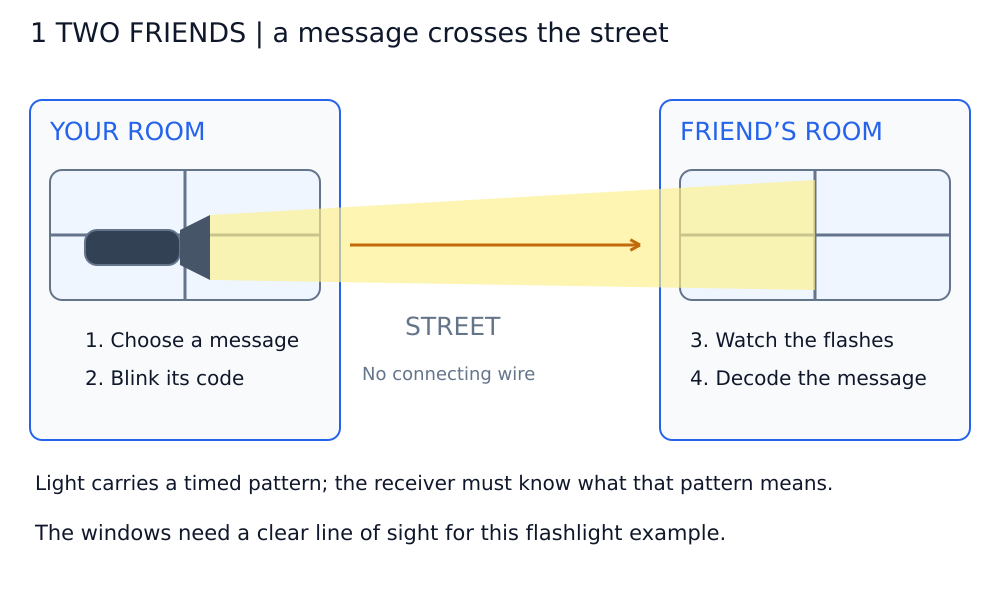
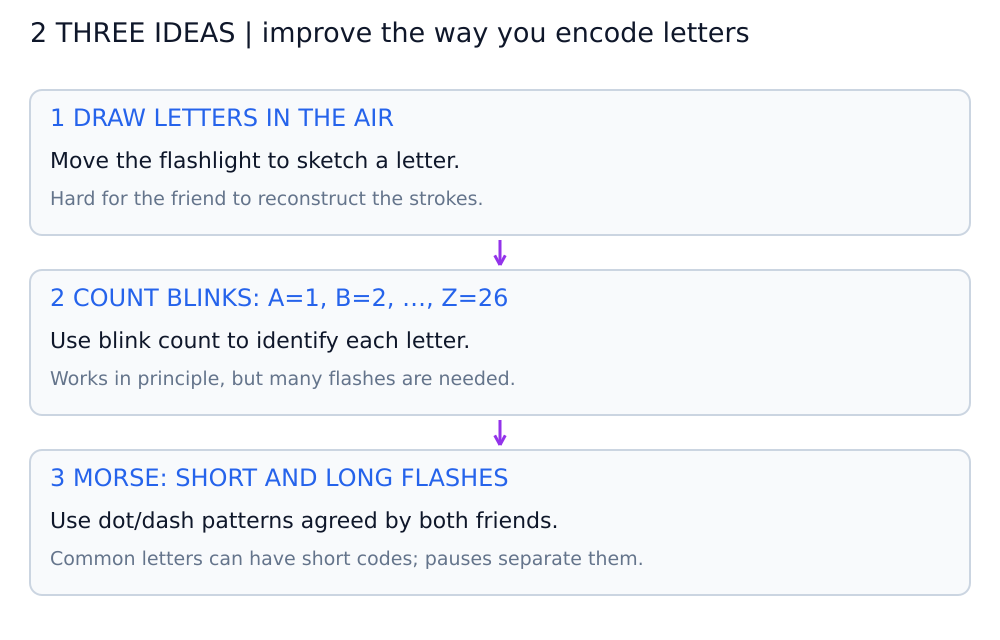
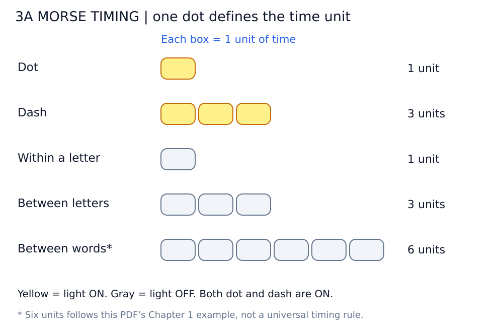
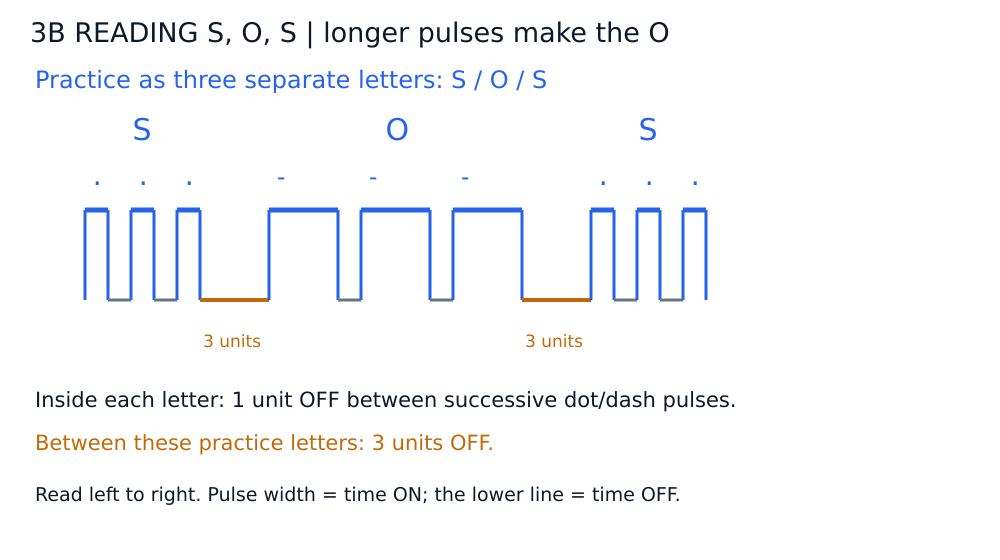
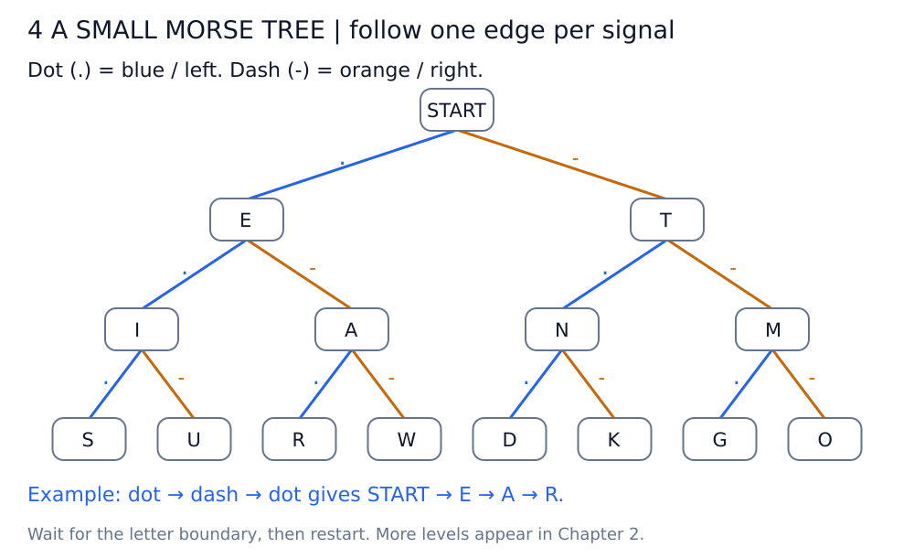
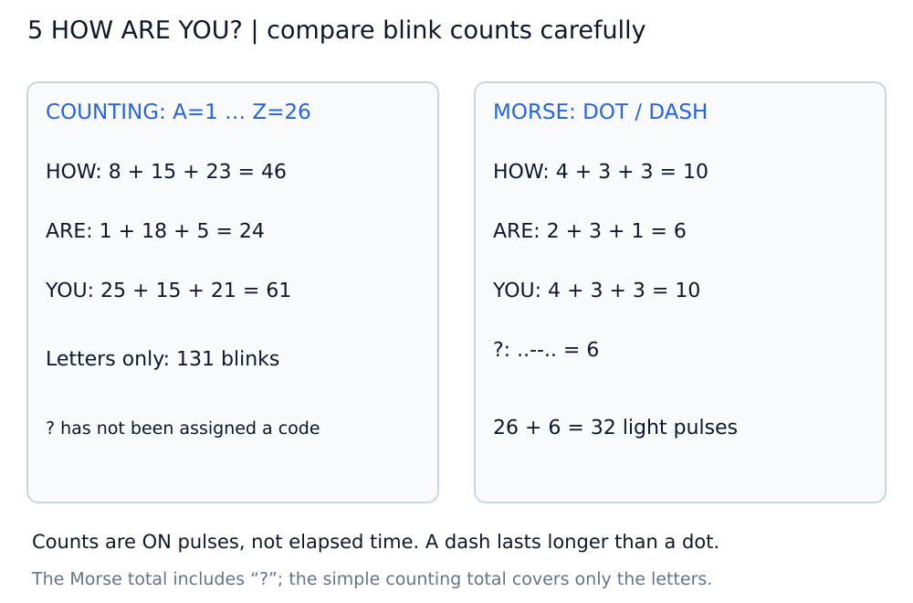
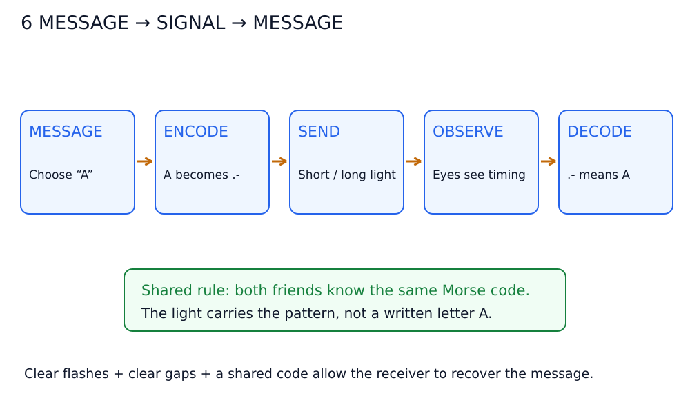

# অধ্যায় ১: Best Friends — ছবি দেখে বোঝো

**দুই বন্ধু আগে ঠিক করে নেয় কোন light pattern কী বোঝাবে। একজন সেই pattern পাঠায়, অন্যজন দেখে অর্থ উদ্ধার করে। এটাই code দিয়ে যোগাযোগ।**

ছবিগুলো **Markdown Preview**-তে দেখো অথবা `diagrams/`-এর SVG সরাসরি খোলো। Mermaid প্রয়োজন নেই। `.` = dot, `-` = dash; timing ছবিতে yellow = আলো ON, gray = OFF।

## ডায়াগ্রাম ১: দুই ঘরের জানালা দিয়ে message পাঠানো

**বাঁয়ের বন্ধু:** কথা/অক্ষর বেছে নেয় → Morse pattern অনুযায়ী flashlight জ্বালায় ও নেভায়।

**ডানের বন্ধু:** আলোর duration ও gap দেখে → একই code ব্যবহার করে letter ও message উদ্ধার করে।

এই দৃশ্যের দুই ঘরের মাঝে কোনো electrical wire নেই; signal যায় **আলো** হিসেবে। জানালার মাঝে line of sight থাকতে হয়।

## ডায়াগ্রাম ২: অক্ষর আঁকা থেকে dot–dash

1. **বাতাসে অক্ষর আঁকা:** বন্ধুকে আলোর চলা দেখে আলাদা stroke মাথায় জোড়া দিতে হয়—বোঝা কঠিন।
2. **A=1, B=2…Z=26 বার blink:** গণনা করে অক্ষর বোঝা যায়, কিন্তু অনেক blink লাগে। Letter ও word আলাদা করার pause-ও চাই।
3. **Morse code:** ছোট ও বড় flash-এর pattern দিয়ে অক্ষর বোঝায়; যেমন `E = .`, `T = -`, `A = .-`।

**মূল পরিবর্তন:** অক্ষরের shape আঁকার বদলে সেই অক্ষরের জন্য একটি agreed pattern পাঠানো হচ্ছে। Code মানেই গোপন সংকেত নয়—দুজনের কাছে তার নিয়ম পরিষ্কার থাকা দরকার।

## ডায়াগ্রাম ৩: Timing—আলো কতক্ষণ জ্বলবে, কতক্ষণ নিভবে?

### ক. Dot, dash ও pause আলাদা করে দেখো

| ঘটনা | আলো | Relative time |
| --- | --- | --- |
| Dot | ON | 1 unit |
| Dash | ON | 3 units |
| একই letter-এর দুই element-এর মাঝখান | OFF | 1 unit |
| দুই letter-এর মাঝখান | OFF | 3 units |
| দুই word-এর মাঝখান | OFF | এই PDF-এর Chapter 1-এর উদাহরণে 6 units |

**এক unit মানেই এক second নয়।** Sender দ্রুত বা ধীরে পাঠাতে পারে; এখানে duration-এর অনুপাত বোঝানো হচ্ছে। Word gap-এর 6 units সংযুক্ত বইয়ের উদাহরণ অনুসরণ করে লেখা হয়েছে; এটিকে সর্বজনীন timing rule হিসেবে নিও না।

**Dot ও dash দুটিই আলো ON।** Dash হলো দীর্ঘ flash, আলো OFF নয়। OFF সময় দিয়ে element, letter ও word-এর boundary বোঝানো হয়।

### খ. S, O, S—তিনটি letter-এর অনুশীলন

ওপরের রেখা মানে ON, নিচের রেখা OFF। বাঁ থেকে ডানে সময় এগোয়।

- **S = `...`**: তিনটি ছোট flash; প্রতিটির মাঝখানে ছোট gap।
- **O = `---`**: তিনটি বড় flash; এখানেও প্রতিটির মাঝে ছোট gap।
- পরের **S** আবার তিনটি ছোট flash।

এই ছবিতে **S, O, S-কে তিনটি আলাদা letter হিসেবে** অনুশীলন দেখানো হয়েছে, মাঝে 3-unit letter gap। এটি distress signal-এর operational transmission শেখানোর ছবি নয়।

## ডায়াগ্রাম ৪: Signal ধরে letter খোঁজার ছোট tree

এটি chapter-এর code বুঝতে সহায়ক ছবি; tree-এর বিস্তারিত আলোচনা Chapter ২-এ।

প্রতিটি dot পেলে নীল/bাঁয়ের branch, dash পেলে কমলা/ডানের branch ধরো। যেমন **`.-.` → START → E → A → R**।

**Letter boundary না পাওয়া পর্যন্ত letter লেখা শেষ করো না।** E ও A মাঝপথেও আসে, কিন্তু আরও signal এলে এগোতে হবে। একটি letter শেষ হলে পরেরটির জন্য START-এ ফেরো।

## ডায়াগ্রাম ৫: “HOW ARE YOU?” পাঠাতে কতবার আলো জ্বলে?

| অংশ | A=1…Z=26 counting | Morse-এর ON pulse |
| --- | --- | --- |
| HOW | 8 + 15 + 23 = 46 | 4 + 3 + 3 = 10 |
| ARE | 1 + 18 + 5 = 24 | 2 + 3 + 1 = 6 |
| YOU | 25 + 15 + 21 = 61 | 4 + 3 + 3 = 10 |
| ? | কোনো নিয়ম এখনও ঠিক করা হয়নি | `..--..` = 6 |
| মোট | শুধু letter-এ **131 blinks** | প্রশ্নবোধক চিহ্নসহ **32 pulses** |

**32-এর মধ্যে `?`-এর 6টি pulse আছে।** শুধু HOW ARE YOU-এর letter-গুলোতে Morse pulse 26টি।

এখানে গণনা হচ্ছে আলো কতবার ON হয়েছে; মোট কত second লেগেছে তা নয়। Dash dot-এর চেয়ে দীর্ঘ, আর মাঝখানে pause আছে—তাই 131÷32-কে সরাসরি speedup বলা যাবে না।

## ডায়াগ্রাম ৬: Message → code → signal → meaning

**Message `A` → code `.-` → ছোট flash + gap + বড় flash → চোখে pattern দেখা → আবার `A` বোঝা।**

এটি chapter-এর দৃশ্য বোঝানোর সরল communication model। Sender code-কে physical signal-এ প্রকাশ করে; receiver একই নিয়ম ব্যবহার করে সেই signal-এর অর্থ উদ্ধার করে।

আলো নিজে লেখা “A” নিয়ে যায় না; পাঠায় একটি সময়ভিত্তিক pattern। দুজনের code-এর নিয়ম না মিললে pattern দেখা গেলেও সঠিক message বোঝা যাবে না।

## নিজের বোঝা যাচাই করো

1. Code কি সবসময় secret? — **না, বোঝাপড়ার agreed rule।**
2. Dash মানে আলো বন্ধ? — **না, দীর্ঘ সময় আলো জ্বলা।**
3. Pause দরকার কেন? — **Element, letter ও word আলাদা করতে।**
4. “HOW ARE YOU?”-এর 32 pulse-এ `?` আছে? — **হ্যাঁ, তার জন্য 6টি pulse।**
5. একই letter অন্য মাধ্যমেও পাঠানো যায়? — **হ্যাঁ, যেমন একই timing আলো বা শব্দে প্রকাশ করা যায়।**
