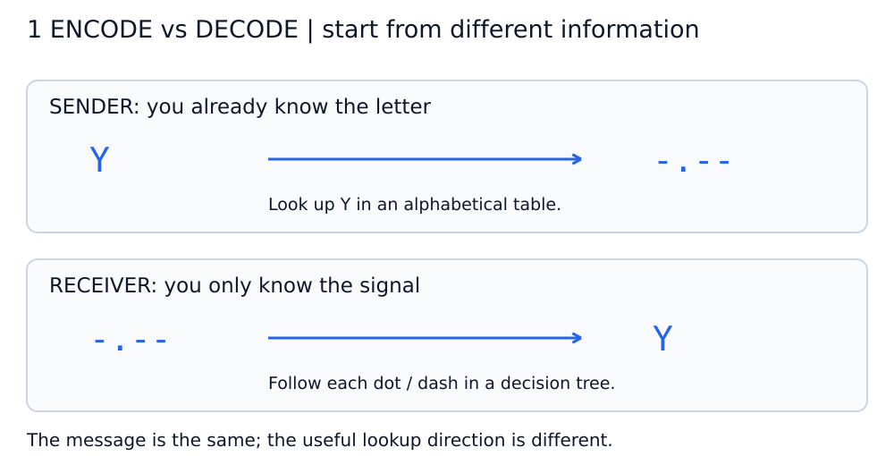
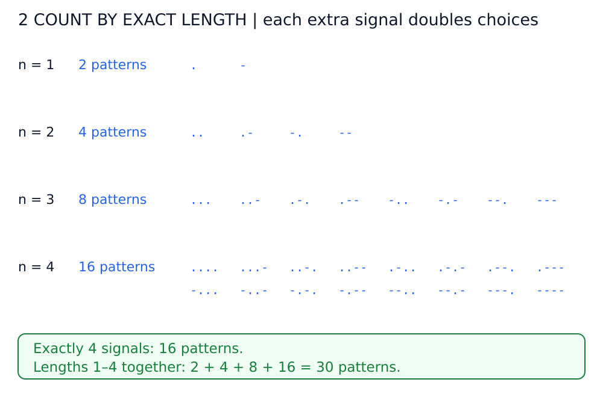
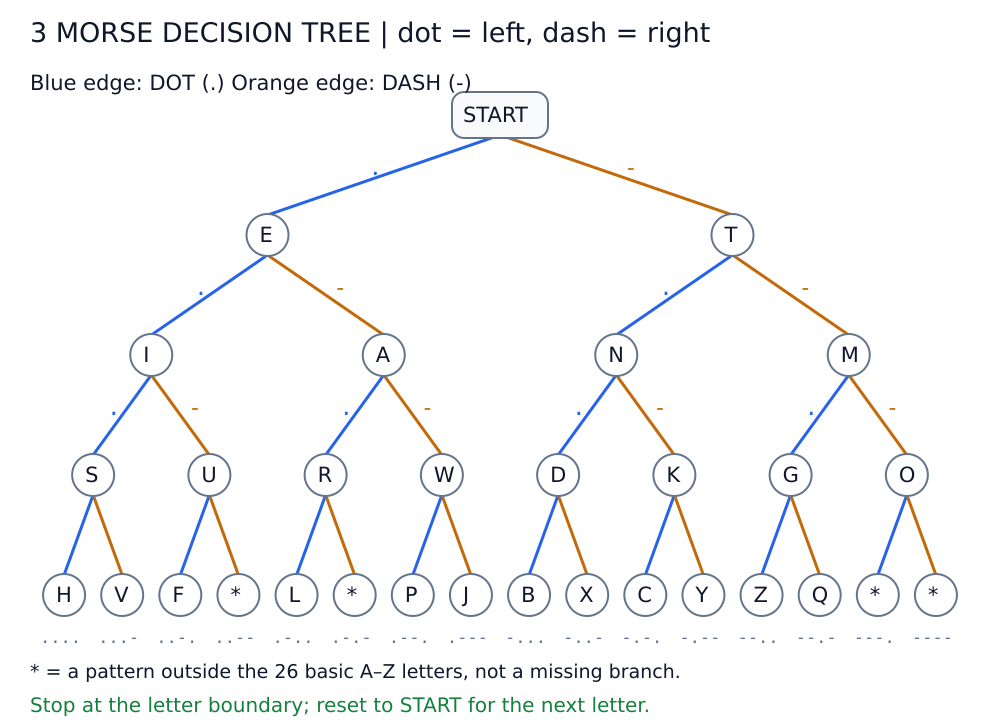
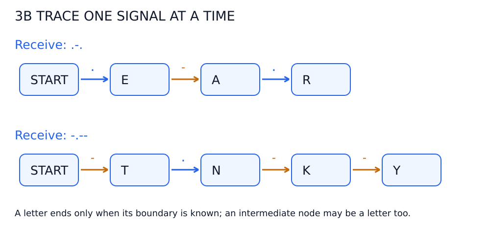
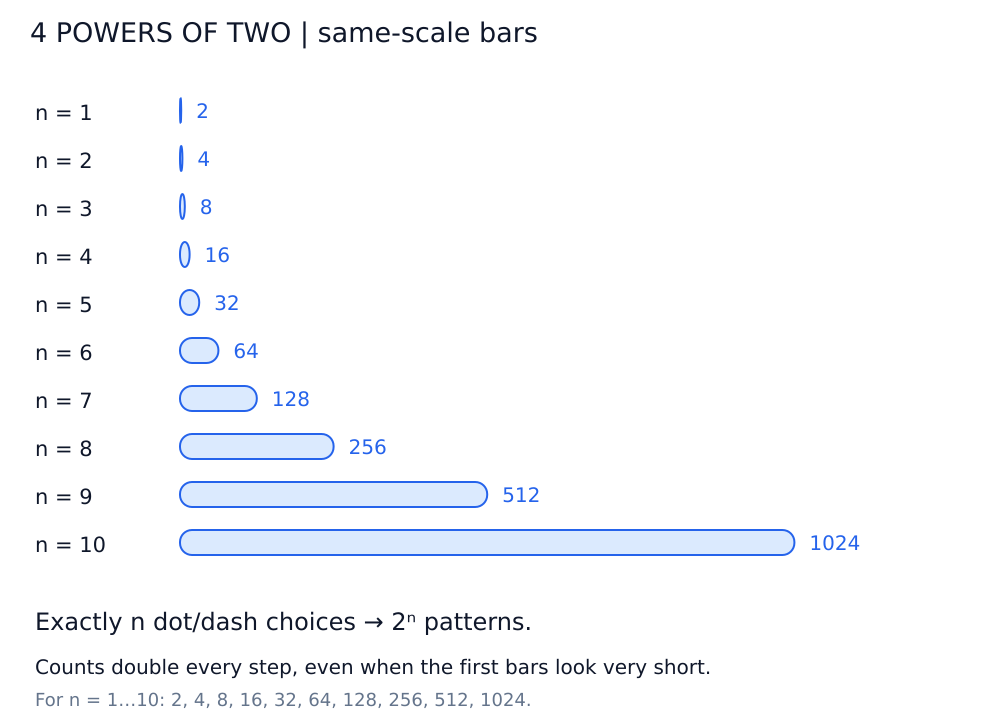
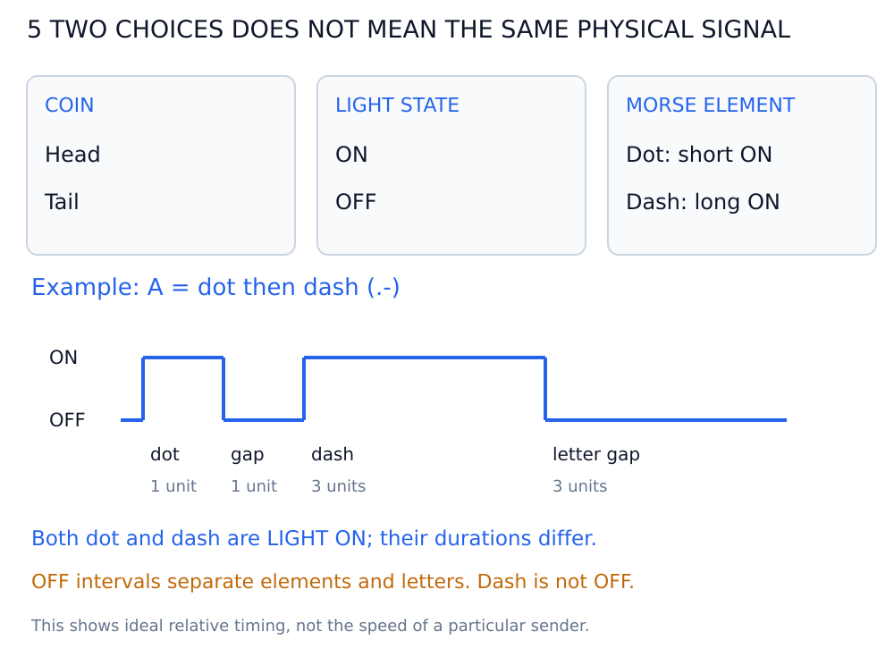

# অধ্যায় ২: Codes and Combinations — ছবি দেখে বোঝো

**প্রতিটি position-এ দুটি পছন্দ: dot অথবা dash। ঠিক nটি position থাকলে 2ⁿটি pattern হয়।**

ছবিগুলো **Markdown Preview**-তে দেখো অথবা `diagrams/`-এর SVG সরাসরি খোলো। Mermaid প্রয়োজন নেই। ছবিতে `.` = dot, `-` = dash; tree-তে **নীল branch dot, কমলা branch dash**।

## ডায়াগ্রাম ১: পাঠানো সহজ, উল্টো দিক থেকে খোঁজা কঠিন কেন?

**Sender:** জানে letter হলো `Y`। Alphabetical table-এ Y খুঁজে code `-.--` পায়।

**Receiver:** জানে শুধু `-.--`। একই alphabetical table-এ মিল খুঁজতে অনেক entry দেখতে হতে পারে। Signal অনুযায়ী সাজানো tree-তে গেলে প্রতিটি dot/dash ধরে এগোনো যায়।

এটি শেখার সময় lookup-এর সমস্যা; অভিজ্ঞ Morse reader প্রতিটি letter পেতে table scan করেন, এমন নয়।

## ডায়াগ্রাম ২: ঠিক কতটি signal নিলে কতটি pattern?

| ঠিক যতটি dot/dash | সম্ভাব্য pattern | উদাহরণ |
| --- | --- | --- |
| 1 | 2¹ = 2 | `.` ও `-` |
| 2 | 2² = 4 | `..`, `.-`, `-.`, `--` |
| 3 | 2³ = 8 | `...` থেকে `---` |
| 4 | 2⁴ = 16 | `....` থেকে `----` |

**“ঠিক ৪টি” আর “সর্বোচ্চ ৪টি” আলাদা:**

- ঠিক ৪টি signal → **১৬টি** pattern।
- ১, ২, ৩ বা ৪টি signal → **২ + ৪ + ৮ + ১৬ = ৩০টি** nonempty pattern।

বইয়ের চারটি table-এ ২৬টি basic Latin letter এবং আরও ৪টি accented letter দেখানো হয়েছে। Pattern-এর সংখ্যা গাণিতিকভাবে নির্ধারিত; কোন pattern-কে কোন অর্থ দেওয়া হবে, সেটি code-এর নিয়ম।

## ডায়াগ্রাম ৩: Morse decoding tree

**ওপরের START থেকে শুরু করো।** প্রতিটি `.` পেলে বাঁয়ের নীল branch, প্রতিটি `-` পেলে ডানের কমলা branch ধরো। একটি signal-এ এক level নিচে নামবে।

ছবিতে basic **A–Z** দেখানো হয়েছে। চারটি `*` node হলো এই alphabet-এর বাইরের pattern; এগুলোকে ভুল বা সর্বক্ষেত্রে undefined বলছি না। বইয়ের accented-letter তালিকার বিস্তারিত এখানে বাদ দিয়ে branch-গুলো রাখা হয়েছে।

### দুটি উদাহরণ হাতে ধরে অনুসরণ করো

- `.-.`: START → dot → **E** → dash → **A** → dot → **R**।
- `-.--`: START → dash → **T** → dot → **N** → dash → **K** → dash → **Y**।

**মাঝপথে letter দেখলেই থেমে যেও না।** E, A ও R—প্রতিটিই letter, কিন্তু signal sequence কোথায় শেষ হয়েছে সেটি জানতে হবে। Letter-এর gap পেলে পাওয়া letter পড়ো, তারপর পরেরটির জন্য START-এ ফিরে যাও। Tree একা message-এর letter boundary নির্ধারণ করে না।

## ডায়াগ্রাম ৪: ২-এর ঘাত—প্রতিটি ধাপে দ্বিগুণ

একটি পুরোনো pattern-এর শেষে হয় dot, নয় dash বসানো যায়। তাই প্রতিটি পুরোনো pattern থেকে দুটি নতুন pattern হয়। যেমন `.-` থেকে `.-.` এবং `.--`।

**nটি signal → 2ⁿটি pattern।** ছবির সব bar একই linear scale-এ, তাই প্রথম দিকের ছোট সংখ্যাগুলোর bar খুব ছোট।

| বিষয় | ফল |
| --- | --- |
| ঠিক 5টি signal | 32টি pattern |
| ঠিক 6টি signal | 64টি pattern |
| 1 থেকে 6টি signal মিলিয়ে | 2 + 4 + 8 + 16 + 32 + 64 = 126টি nonempty pattern |
| ঠিক 10টি signal | 1024টি pattern |

সব সম্ভাব্য pattern যে ব্যবহৃত Morse character হবে, তা নয়। কোনো code system কিছু pattern assign না-ও করতে পারে।

এখানে n হলো **dot/dash-এর সংখ্যা**, সময়ের unit নয়। Dot ও dash-এর duration আলাদা; একই সংখ্যক element-এর দুই pattern পাঠাতে একই সময় নাও লাগতে পারে।

## ডায়াগ্রাম ৫: দুটি পছন্দ বনাম বাস্তব ON/OFF timing

Coin-এর head/tail, light-এর ON/OFF এবং Morse-এর dot/dash—প্রতিটি উদাহরণে দুটি বিকল্প আছে। **এগুলো সরাসরি একই physical mapping নয়।**

Flashlight দিয়ে পাঠালে:

- **Dot:** অল্প সময় আলো ON।
- **Dash:** বেশি সময় আলো ON।
- **OFF সময়:** element ও letter-এর মাঝের gap।

ছবির `A = .-`-তে ideal relative timing: **1 unit ON → 1 unit OFF → 3 units ON → 3 units OFF**, তারপর পরের letter শুরু হতে পারে।

তাই **dot = ON, dash = OFF** লেখা ভুল ধারণা দেয়। Dot ও dash দুটিই আলো জ্বলার ঘটনা; পার্থক্য হলো কতক্ষণ জ্বলে।

## নিজের বোঝা যাচাই করো

1. ঠিক ৪টি dot/dash-এ কত pattern? — **16।**
2. ১–৪টি dot/dash মিলিয়ে কত nonempty pattern? — **30।**
3. `.-.` tree-তে কোন letter? — **R।**
4. `-.--` কোন letter? — **Y।**
5. Dash মানে আলো OFF? — **না, দীর্ঘ সময় ON।**
6. Tree-তে E পৌঁছালেই letter শেষ? — **না, letter boundary জানা দরকার।**
