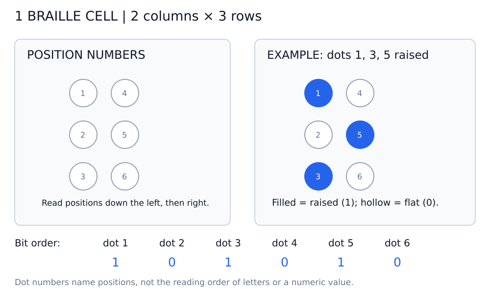
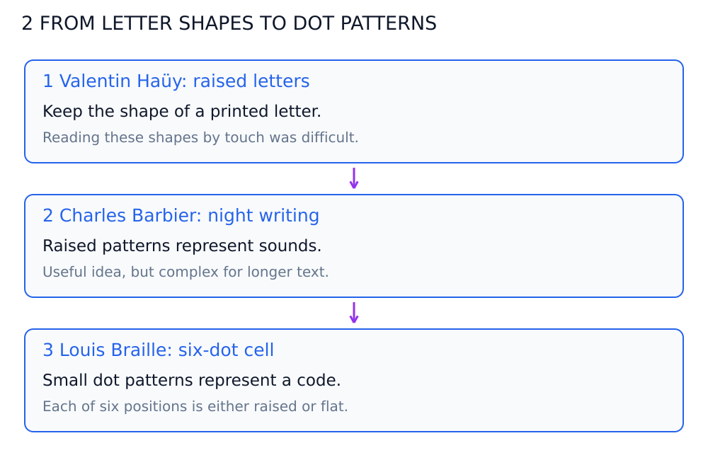
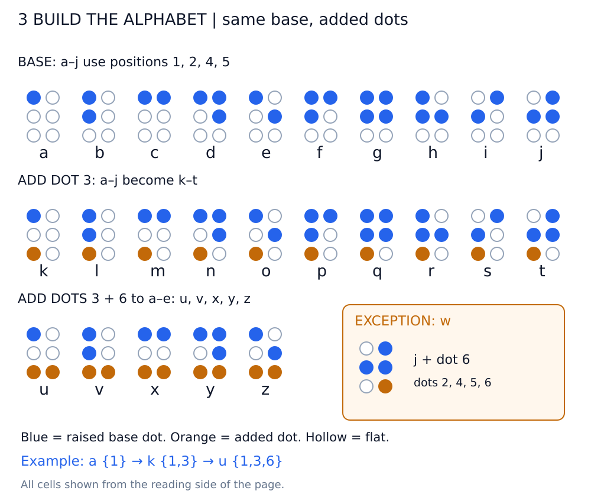
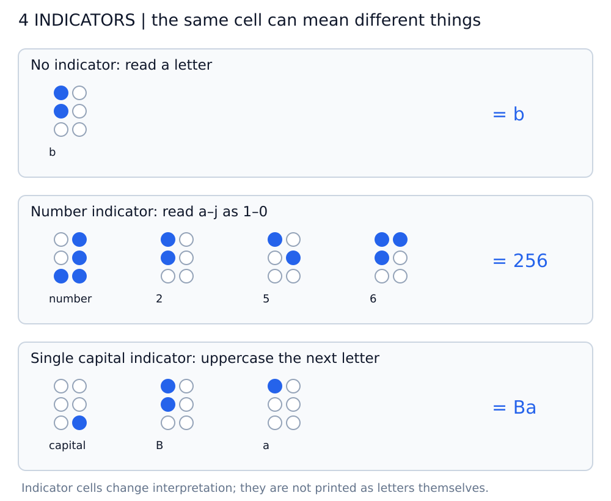
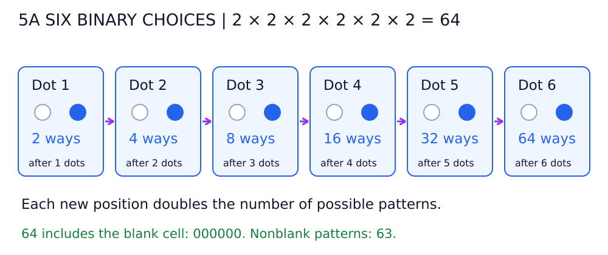
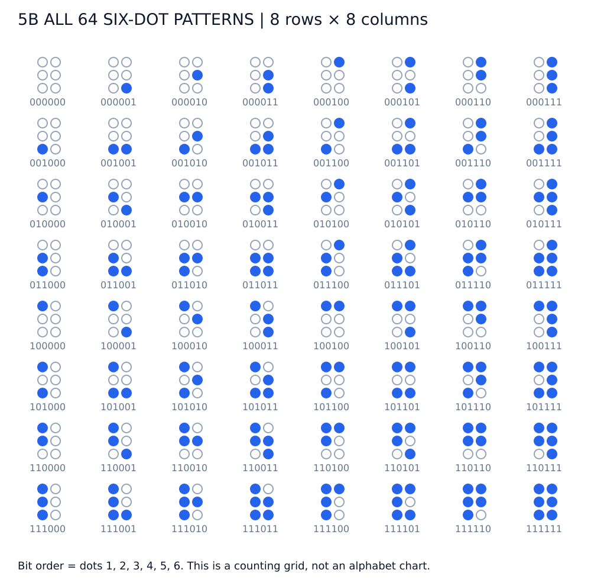

# অধ্যায় ৩: Braille and Binary Codes — ছবি দেখে বোঝো

**একটি Braille cell-এ ৬টি position। প্রতিটিতে dot উঁচু অথবা সমতল—দুটি অবস্থা। তাই 2⁶ = 64টি আলাদা pattern হয়।**

ছবিগুলো **Markdown Preview**-তে দেখো অথবা `diagrams/`-এর SVG সরাসরি খোলো। Mermaid প্রয়োজন নেই।

**চিহ্ন:** ভরাট নীল/কমলা বৃত্ত = raised dot; ফাঁপা বৃত্ত = flat position। আসল কাগজে flat position-এ বৃত্ত আঁকা থাকে না; শেখার সুবিধার জন্য এখানে দেখানো হয়েছে। ছবির orientation হলো **পড়ার দিক থেকে**, পেছন থেকে emboss করার দিক নয়।

## ডায়াগ্রাম ১: Braille cell-এর গঠন ও dot position

**বাঁ column ওপর থেকে 1, 2, 3; ডান column ওপর থেকে 4, 5, 6।** পাশাপাশি সারি ধরে 1, 2, 3… লিখবে না।

ডান ছবিতে **1, 3, 5 raised**। আমরা bit লেখার ক্রম ধরেছি `[dot 1, dot 2, dot 3, dot 4, dot 5, dot 6]`; তাই pattern `101010`।

- Position number বলে **কোন জায়গা** বোঝাচ্ছি।
- Bit 1/0 বলে সেই জায়গায় **raised না flat**।
- এই bit order নোটের ব্যাখ্যার সুবিধার জন্য; এটি Unicode Braille-এর numeric encoding নির্ধারণ করছে না।

## ডায়াগ্রাম ২: Raised letter থেকে ছয়-dot code

**প্রথম ধাপ:** Haüy পরিচিত অক্ষরের shape উঁচু করে ছাপতেন, কিন্তু ছুঁয়ে পড়া কঠিন ছিল।

**দ্বিতীয় ধাপ:** Barbier-এর night writing-এ raised pattern দিয়ে sound বোঝানো হতো। ধারণাটি কাজে লাগলেও দীর্ঘ লেখা প্রকাশে জটিল ছিল।

**তৃতীয় ধাপ:** Louis Braille ছোট ছয়-dot cell-এর code তৈরি করেন। অক্ষর বোঝাতে তার দৃশ্যমান shape নকল করা দরকার হলো না।

**মূল শিক্ষা: একই তথ্য অন্য pattern দিয়ে প্রকাশ করা যায়—যে মাধ্যম দিয়ে পড়ব, তার উপযোগী code বেছে নেওয়া যায়।**

## ডায়াগ্রাম ৩: Dot যোগ করে letter তৈরি

ছবির **একই column ধরে ওপর থেকে নিচে** দেখো। নীল dot আগের pattern; কমলা dot নতুন যোগ করা position।

| শুরু | কী যোগ করি? | ফল |
| --- | --- | --- |
| a–j | Dot 3 | k–t |
| a–e | Dot 3 ও 6 | u, v, x, y, z |
| j | Dot 6 | w |

**সবচেয়ে ছোট উদাহরণ:** `a = {1}` → dot 3 যোগে `k = {1,3}` → dot 6 যোগে `u = {1,3,6}`।

`w` তৃতীয় সারির নিয়মের মধ্যে বসবে না; তাই ছবিতে আলাদা। আর a–j ওপরের চার position ব্যবহার করলেও ওই চার position-এর সব ১৬টি combination ব্যবহার করে না—এখানে মাত্র ১০টি letter pattern দেখানো হয়েছে।

## ডায়াগ্রাম ৪: Indicator-এর কারণে একই pattern-এর অর্থ বদলায়

**প্রতিটি row বাঁ থেকে ডানে পড়ো।** একটি indicator-ও আলাদা ছয়-dot cell; এটি পরের cell কীভাবে পড়তে হবে সেই নির্দেশ দেয়।

- প্রথম row: `{1,2}` pattern একা থাকলে এখানে letter **b**।
- দ্বিতীয় row: **number indicator `{3,4,5,6}`**, তারপর b/e/f-এর pattern → **256**।
- তৃতীয় row: **single capital indicator `{6}`**, তারপর b ও a → **Ba**; শুধু পরের letter uppercase হয়েছে।

| Letter pattern | a | b | c | d | e | f | g | h | i | j |
| --- | --- | --- | --- | --- | --- | --- | --- | --- | --- | --- |
| Number হিসেবে | 1 | 2 | 3 | 4 | 5 | 6 | 7 | 8 | 9 | 0 |

### Shift আর escape-এর ধারণা

বইয়ের ব্যাখ্যায় **number indicator একটি shift-এর উদাহরণ**: পরের a–j pattern-গুলোকে number হিসেবে পড়তে বলে। বইয়ে **letter indicator `{5,6}`** দিয়ে letter interpretation-এ ফেরার কথাও আছে।

**Single capital indicator একটি escape-এর উদাহরণ**: শুধু পরের letter-এর interpretation বদলায়। তাই ছবিতে `Ba`, `BA` নয়।

এগুলো সংযুক্ত বইয়ের উদাহরণ বোঝানোর জন্য। Braille-এর language, grade ও standard অনুযায়ী পূর্ণ indicator এবং termination নিয়ম আলাদা হতে পারে; এই ছবিকে সব Braille-এর সম্পূর্ণ grammar ধরে নিও না।

**মূল কথা: pattern একই থাকতে পারে, কিন্তু context বদলালে অর্থ বদলায়।** তাই ৬৪টি pattern মানে কেবল ৬৪টি অক্ষর বা অর্থ নয়; একাধিক cell ও context দিয়ে আরও অনেক কিছু প্রকাশ করা যায়।

## ডায়াগ্রাম ৫: ছয়টি binary choice থেকে ৬৪টি pattern

### ক. প্রতিটি নতুন position-এ সম্ভাবনা দ্বিগুণ

একটি dot-এ ২টি অবস্থা। প্রতিটি আগের pattern-এর সঙ্গে নতুন position-এ flat অথবা raised যোগ করা যায়। তাই ধাপে ধাপে **2 → 4 → 8 → 16 → 32 → 64**।

ছবির “ways” হলো ওই পর্যন্ত সব dot মিলে মোট combination; একটি dot-এর নিজস্ব state সবসময় দুটি।

### খ. সব ৬৪টি pattern একসঙ্গে

Grid-এ **৮ সারি × ৮ column = ৬৪টি cell**। প্রথমটি blank `000000`; শেষটিতে সব raised `111111`।

এটি alphabet chart নয়; শুধু সব binary pattern গুনে দেখানো। প্রতিটি cell-এর নিচে নোটে নির্ধারিত dot 1→6 ক্রমে bit লেখা আছে।

- Blank cell-ও একটি বৈধ pattern; বইয়ে শব্দের মাঝে space বোঝাতে এটি ব্যবহৃত হয়েছে।
- Raised dot-সহ nonblank pattern **৬৩টি**; blank-সহ মোট **৬৪টি**।
- Dot 1 raised ধরে নিলে বাকি পাঁচ position-এ 2⁵ = 32টি pattern সম্ভব। Dot 1 flat ধরলেও ৩২টি। এখানে “৩২” pattern-এর সংখ্যা, dot 1-এর কোনো অন্তর্নিহিত মান নয়।

## নিজের বোঝা যাচাই করো

1. ওপরের ডান position-এর নম্বর? — **4।**
2. `{1,3,5}`-কে এই নোটের bit order-এ লিখলে? — **101010।**
3. `a`-তে dot 3 যোগ করলে? — **k।**
4. Number indicator-এর পরে b-pattern কী বোঝায়? — **2।**
5. Blank বাদ দিলে pattern কয়টি? — **63।**
