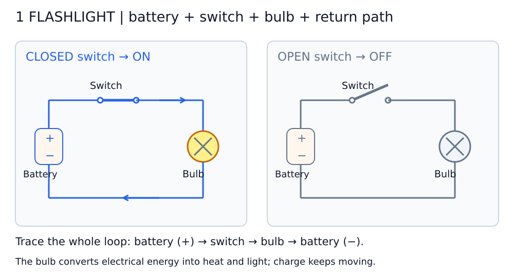
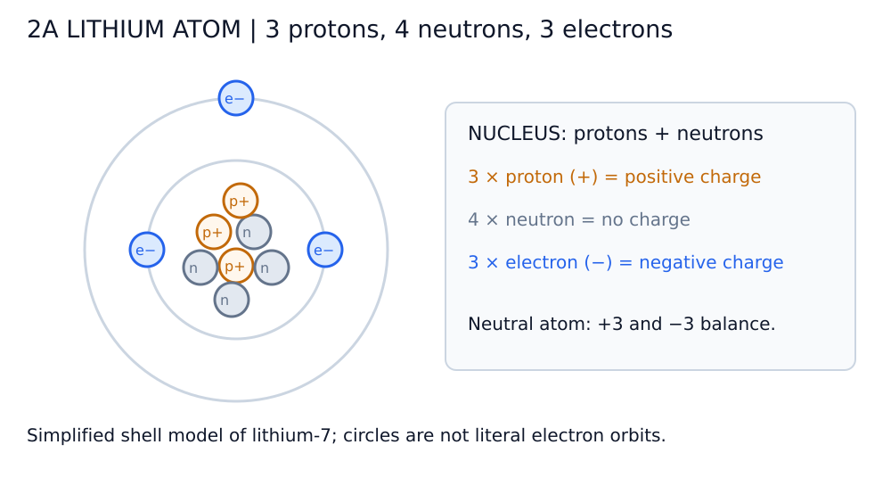
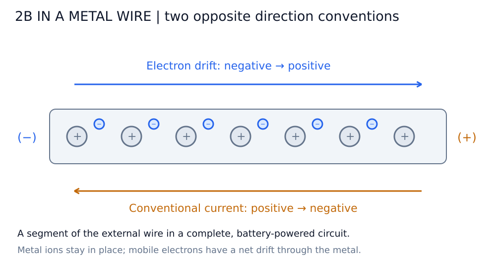
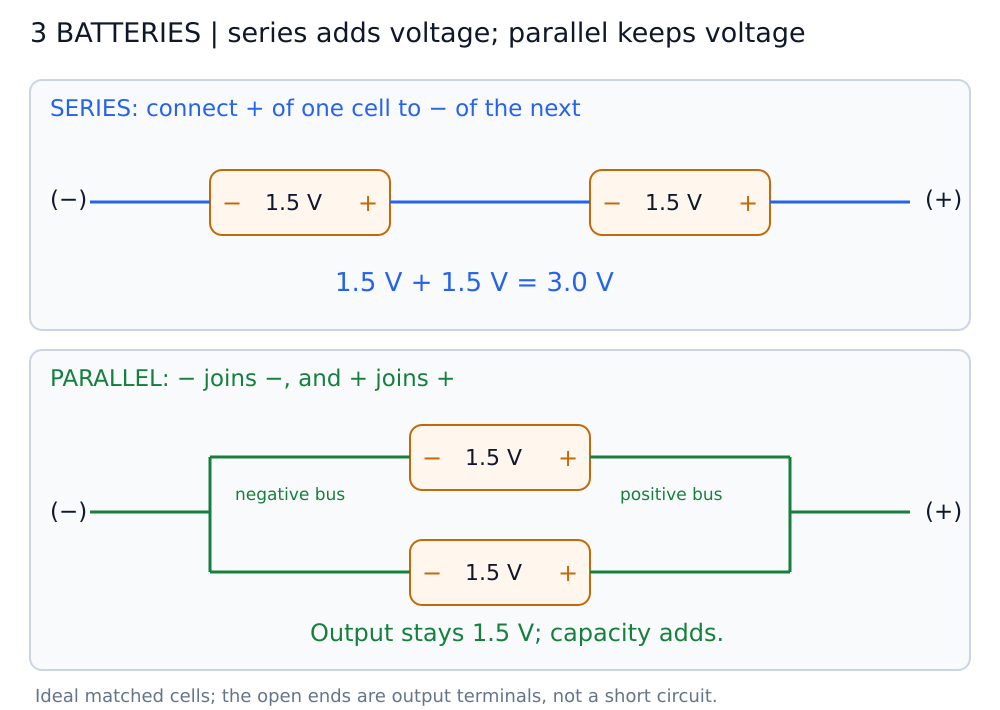
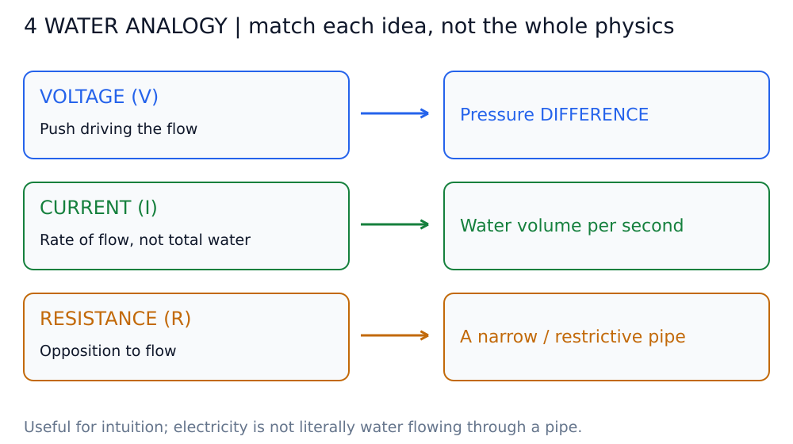
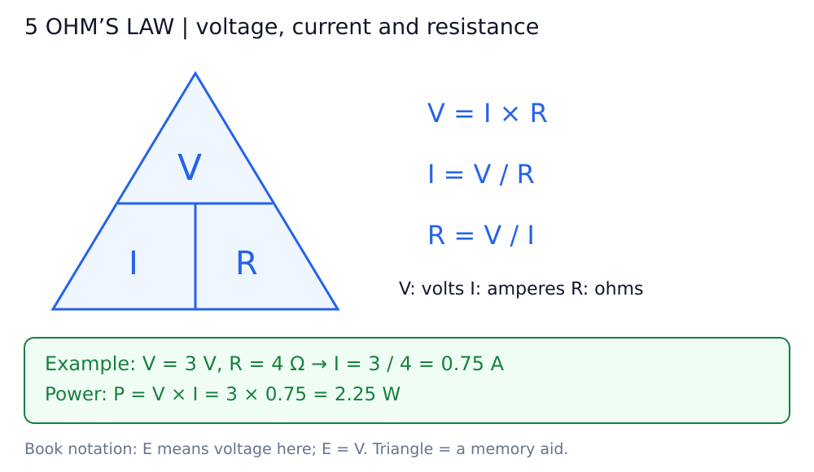
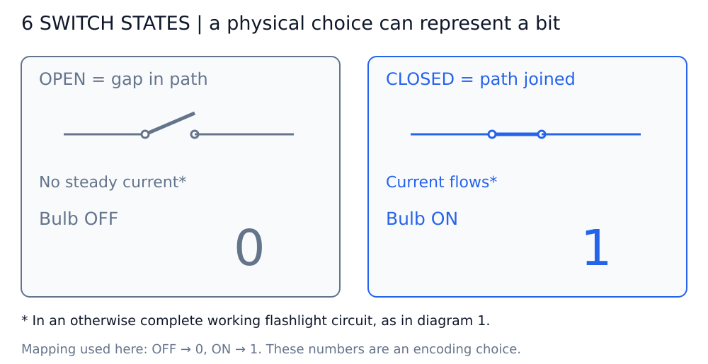

# অধ্যায় ৪: Anatomy of a Flashlight — ছবি দেখে বোঝো

**Battery শক্তি দেয়, switch পথ জোড়া লাগায়, আর bulb-এর filament গরম হয়ে আলো দেয়। কাজ করতে হলে সম্পূর্ণ circuit লাগবে।**

ছবিগুলো **Markdown Preview**-তে দেখো অথবা `diagrams/`-এর SVG সরাসরি খোলো। Mermaid প্রয়োজন নেই।

**চিহ্ন চিনে নাও:** `+` ও `−` = battery terminal; দুই বিন্দুর ফাঁক = open switch; বিন্দু জোড়া = closed switch; ক্রসসহ বৃত্ত = bulb। হলুদ bulb জ্বলছে, ধূসর bulb নিভে আছে।

## ডায়াগ্রাম ১: সরল flashlight circuit

**বাম ছবি:** Battery (+) → switch → bulb → ফেরার তার → Battery (−)। Switch বন্ধ মানে contact জোড়া; তাই current চলার পথ সম্পূর্ণ।

**ডান ছবি:** Switch খোলা, মাঝে ফাঁক। Battery থাকলেও সম্পূর্ণ পথ নেই, তাই steady current চলে না ও bulb নিভে থাকে।

- Battery-র chemical energy বৈদ্যুতিক শক্তি জোগায়।
- Filament হলো bulb-এর ভেতরের পাতলা তার; গরম হলে আলো দেয়। ছবির ক্রস সেটির সহজ symbol।
- Bulb শক্তি নেয়; charge সেখানে খরচ হয়ে শেষ হয় না।

**মনে রাখো: একটি wire দিয়ে bulb-এ পৌঁছানোই যথেষ্ট নয়; battery-তে ফেরার পথও চাই।**

## ডায়াগ্রাম ২: পরমাণু ও electron flow

### ক. Lithium atom-এর সহজ model

মাঝের nucleus-এ **৩টি proton ও ৪টি neutron**; বাইরে **৩টি electron**। এটি বইয়ের lithium-7 উদাহরণ। Neutral atom-এ ৩টি positive ও ৩টি negative charge পরস্পর সাম্য রাখে।

দুটি electron ভেতরের shell-এ, একটি বাইরের shell-এ দেখানো হয়েছে। বৃত্তগুলো বোঝানোর model; electron বাস্তবে গ্রহের মতো এই আঁকা পথে ঘোরে না। Lithium-এর এই ছবি আর নিচের copper/metal wire-এর ছবি আলাদা উদাহরণ।

### খ. Electron flow আর current-এর arrow উল্টো কেন?

| কী দেখছি? | Battery-র বাইরের metal circuit-এ দিক |
| --- | --- |
| Electron-এর net drift | Negative (−) → Positive (+) |
| Conventional current | Positive (+) → Negative (−) |

**এগুলো একই ঘটনার দুটি direction convention।** এই নোটের circuit diagram-এ conventional current দেখানো হয়েছে; বইয়ের electron arrow দেখলে উল্টো দিক পাবে।

ধাতুর positive ion-গুলো তাদের গড় অবস্থানে থাকে; mobile electron-গুলোর net drift হয়। ছবিটি বোঝানোর জন্য সরল করা—electron এক সারিতে নিয়ম মেনে দৌড়াচ্ছে বা প্রত্যেকটি electron দ্রুত পুরো circuit ঘুরছে, এমন নয়।

## ডায়াগ্রাম ৩: Battery series ও parallel

### Series: একটির plus-এর সঙ্গে অন্যটির minus

ওপরের ছবিতে মাঝের wire একটি cell-এর `+`-কে অন্যটির `−`-এর সঙ্গে যুক্ত করেছে। বাইরের দুই terminal-এ মোট voltage: **1.5 + 1.5 = 3 V**।

### Parallel: plus-এর সঙ্গে plus, minus-এর সঙ্গে minus

নিচের ছবিতে দুটি cell **আলাদা branch-এ**। বাঁয়ের সবুজ bus দুই negative terminal-কে এবং ডানের bus দুই positive terminal-কে যুক্ত করেছে। Output voltage থাকে **1.5 V**।

| বৈশিষ্ট্য | Series: দুটি সমান cell | Parallel: দুটি সমান cell |
| --- | --- | --- |
| Output voltage | 3 V | 1.5 V |
| আদর্শ charge capacity (Ah) | একটি cell-এর সমান | দুটি cell-এর capacity যোগ হয় |
| মূল ফল | Voltage বাড়ে | একই voltage-এ বেশি charge সরবরাহ করা যায় |

ছবির বাইরের `−` ও `+` terminal-এর মাঝে load বসালে কাজের circuit সম্পূর্ণ হবে। এগুলো সরাসরি তার দিয়ে জোড়া দেওয়ার নির্দেশ নয়।

একই উপযুক্ত load-এ আদর্শ matched parallel cell একটি cell-এর তুলনায় প্রায় দ্বিগুণ সময় চলতে পারে; বাস্তবে runtime load ও cell-এর অবস্থার ওপর নির্ভর করে। Series-এ voltage বাড়লেই যেকোনো bulb নিরাপদে উজ্জ্বল হবে, এমন নয়—bulb-এর rating মিলতে হবে।

## ডায়াগ্রাম ৪: পানি ও pipe-এর উপমা

- **Voltage:** দুই জায়গার pressure difference-এর মতো—প্রবাহ চালানোর সম্ভাবনা। Circuit খোলা থাকলেও battery-র voltage থাকতে পারে।
- **Current:** প্রতি সেকেন্ডে কতটা পানি যাচ্ছে তার মতো; মোট জমা পানির পরিমাণ নয়। বিদ্যুতে এটি প্রতি সেকেন্ডে charge প্রবাহের হার।
- **Resistance:** সরু বা বাধাযুক্ত pipe-এর মতো; একই pressure difference-এ flow কমায়।

উপমাটি intuition তৈরির জন্য। বিদ্যুৎ আক্ষরিক অর্থে পানি নয়; সব বৈদ্যুতিক ঘটনা এই উপমায় ব্যাখ্যা করা যায় না।

## ডায়াগ্রাম ৫: Ohm’s law ও flashlight-এর হিসাব

বইয়ে voltage-এর জন্য **E**, এখানে **V** লেখা হয়েছে—এই সূত্রে একই পরিমাণ বোঝাচ্ছে।

| যা জানতে চাই | সূত্র | একক |
| --- | --- | --- |
| Voltage | V = I × R | volt (V) |
| Current | I = V / R | ampere (A) |
| Resistance | R = V / I | ohm (Ω) |

Triangle-এ যে রাশি বের করবে তা ঢেকে দাও: নিচে পাশাপাশি থাকলে গুণ; ওপর-নিচে থাকলে ভাগ। এটি সূত্র মনে রাখার কৌশল।

**বইয়ের উদাহরণ:** Series-এ দুটি 1.5 V cell → 3 V। Bulb-এর operating resistance প্রায় 4 Ω ধরলে current **3 ÷ 4 = 0.75 A = 750 mA**। Power **P = V × I = 2.25 W**।

Filament ঠান্ডা থাকলে resistance কম, গরম হলে বাড়ে। তাই 4 Ω-কে সব তাপমাত্রায় স্থির মান ধরে নিও না। Wire ও battery-র internal resistance এই সহজ হিসাবটিতে উপেক্ষা করা হয়েছে।

**Open circuit:** পথ ভাঙা বলে current প্রায় শূন্য। **Short circuit:** খুব কম resistance-এর পথে current অনেক বেড়ে যেতে পারে; বাস্তবে battery ও wire তা সীমিত করে এবং গরম হতে পারে।

## ডায়াগ্রাম ৬: Switch থেকে binary state

| Switch | বিদ্যুতের পথ | Bulb | এখানে ব্যবহৃত bit |
| --- | --- | --- | --- |
| Open / খোলা | বিচ্ছিন্ন | OFF | 0 |
| Closed / বন্ধ | সম্পূর্ণ | ON | 1 |

এখানে battery, bulb ও অন্য wire ঠিক আছে ধরে নেওয়া হয়েছে। **দরজা বন্ধ করলে পথ আটকে যায়; switch বন্ধ করলে contact জোড়া লাগে এবং পথ চালু হয়।**

`OFF = 0`, `ON = 1` হলো আমাদের বেছে নেওয়া encoding। এভাবে একটি physical অবস্থার সঙ্গে binary symbol-এর সম্পর্ক তৈরি করা যায়।

## নিজের বোঝা যাচাই করো

1. Battery থাকলেই bulb জ্বলে? — **না, সম্পূর্ণ circuit দরকার।**
2. Electron flow ও conventional current-এর দিক একই? — **না, metal wire-এ বিপরীত।**
3. দুটি 1.5 V cell parallel করলে 3 V হয়? — **না, 1.5 V থাকে।**
4. Bulb-এর filament কী করে? — **বৈদ্যুতিক শক্তি নিয়ে গরম হয় ও আলো দেয়।**
5. Closed switch মানে OFF? — **না, এই circuit-এ ON।**
