# Chapter 5 — Seeing Around Corners: একনজরে ভিজ্যুয়াল ডায়াগ্রাম গাইড

> **মূল প্রতিপাদ্য:** ফ্ল্যাশলাইটের আলো সরলরেখায় চলে, তাই তা ঘরের কোণ বা বাঁক ঘুরে যেতে পারে না। এই সীমাবদ্ধতা কাটাতেই তার (Wire) ও বৈদ্যুতিক সার্কিটের আগমন। এই অধ্যায়ে শেখানো হয়েছে কীভাবে ৪টি তার থেকে শুরু করে ক্রমান্বয়ে কমন ওয়্যার (৩ তার), আর্থ গ্রাউন্ড (১ ও ২ তার) এবং সবশেষে রিলে (Relay) ব্যবহারের মাধ্যমে মাইলের পর মাইল দূরবর্তী যোগাযোগ সম্ভব হয়।

---

## ১. অধ্যায় ১ থেকে ৫-এর বিবর্তন রূপরেখা (Chapter Overview)

**একনজরে:** দৃষ্টিসীমার ফ্ল্যাশলাইট থেকে শুরু করে কীভাবে আমরা দীর্ঘ দূরত্বের বৈদ্যুতিক টেলিগ্রাফে পৌঁছালাম।

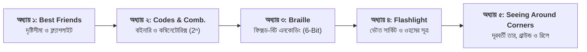
```mermaid
flowchart LR
    Ch1["<b>অধ্যায় ১: Best Friends</b><br/>দৃষ্টিসীমা ও ফ্ল্যাশলাইট"]
    Ch2["<b>অধ্যায় ২: Codes & Comb.</b><br/>বাইনারি ও কম্বিনেটোরিক্স (2ⁿ)"]
    Ch3["<b>অধ্যায় ৩: Braille</b><br/>ফিক্সড-বিট এনকোডিং (6-Bit)"]
    Ch4["<b>অধ্যায় ৪: Flashlight</b><br/>ভৌত সার্কিট ও ওহমের সূত্র"]
    Ch5["<b>অধ্যায় ৫: Seeing Around Corners</b><br/>দূরবর্তী তার, গ্রাউন্ড ও রিলে"]

    Ch1 --> Ch2 --> Ch3 --> Ch4 --> Ch5
```

---

## ২. মূল সমস্যা: সরলরৈখিক দৃষ্টিসীমা (Line of Sight Problem)

**একনজরে:** ফ্ল্যাশলাইটের আলো কেবল তখনই দেখা যায় যখন প্রেরক ও গ্রাহক সরাসরি মুখোমুখি থাকে।

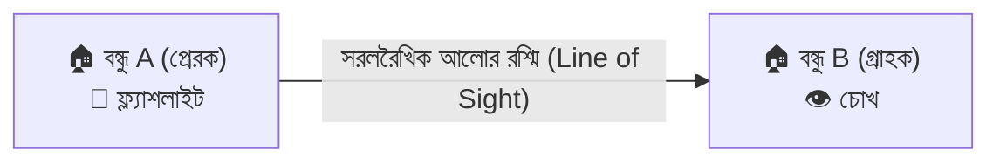
```mermaid
flowchart LR
    A["🏠 বন্ধু A (প্রেরক)<br/>🔦 ফ্ল্যাশলাইট"] -->|"সরলরৈখিক আলোর রশ্মি (Line of Sight)"| B["🏠 বন্ধু B (গ্রাহক)<br/>👁️ চোখ"]
```

- **সীমাবদ্ধতা:** মাঝে কোনো দেয়াল, বাড়ি, গাছ বা কুয়াশা থাকলে আলো পৌঁছায় না।

---

## ৩. কোণ ঘোরার সমস্যা (The Corner Problem)

**একনজরে:** আলো বাঁক নিতে পারে না। বন্ধুর ঘর যদি রাস্তার মোড়ে বা দেয়ালের পেছনে হয়, ফ্ল্যাশলাইট সম্পূর্ণ অকেজো।

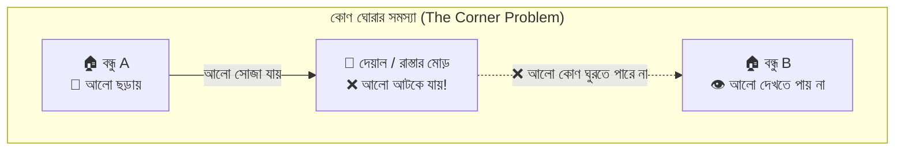
```mermaid
flowchart TD
    subgraph CornerProblem ["কোণ ঘোরার সমস্যা (The Corner Problem)"]
        direction LR
        A["🏠 বন্ধু A<br/>🔦 আলো ছড়ায়"] -->|"আলো সোজা যায়"| Wall["🧱 দেয়াল / রাস্তার মোড়<br/>❌ আলো আটকে যায়!"]
        Wall -.->|"❌ আলো কোণ ঘুরতে পারে না"| B["🏠 বন্ধু B<br/>👁️ আলো দেখতে পায় না"]
    end
```

---

## ৪. তারভিত্তিক সমাধান: ইলেকট্রিক্যাল সার্কিট (Wire-Based Solution)

**একনজরে:** আলো বাঁক নিতে পারে না, কিন্তু **তামার তার (Copper Wire) যেকোনো দিকে বাঁকানো যায়** এবং ইলেকট্রন তারের ভেতর দিয়ে বাঁক ঘুরে পৌঁছে যায়।

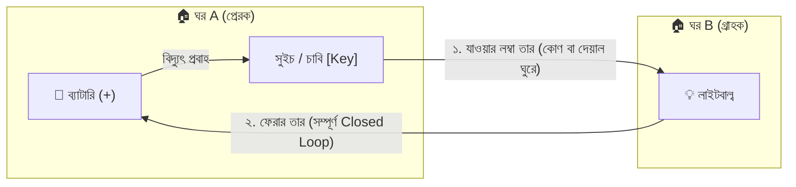
```mermaid
flowchart LR
    subgraph HouseA ["🏠 ঘর A (প্রেরক)"]
        Bat["🔋 ব্যাটারি (+)"]
        Sw["সুইচ / চাবি [Key]"]
    end

    subgraph HouseB ["🏠 ঘর B (গ্রাহক)"]
        Bulb["💡 লাইটবাল্ব"]
    end

    Bat -->|"বিদ্যুৎ প্রবাহ"| Sw
    Sw -->|"১. যাওয়ার লম্বা তার (কোণ বা দেয়াল ঘুরে)"| Bulb
    Bulb -->|"২. ফেরার তার (সম্পূর্ণ Closed Loop)"| Bat
```

> **মূল নীতি:** বিদ্যুৎ চলার জন্য সবসময় একটি **সম্পূর্ণ বদ্ধ লুপ (Closed Loop)** দরকার। শুধু একটি তার দিয়ে পৌঁছালেই হবে না, ব্যাটারির অপর প্রান্তে ফিরে আসার পথও থাকতে হবে।

---

## ৫. বিদ্যুতের মাধ্যমে মোর্স কোড (Morse Code via Electricity)

**একনজরে:** সুইচে চাপ দেওয়ার সময়কাল দিয়ে ডট (.) ও ড্যাশ (-) তৈরি হয়, যা দূরবর্তী বাল্বে আলো বা শব্দ হিসেবে প্রকাশ পায়।

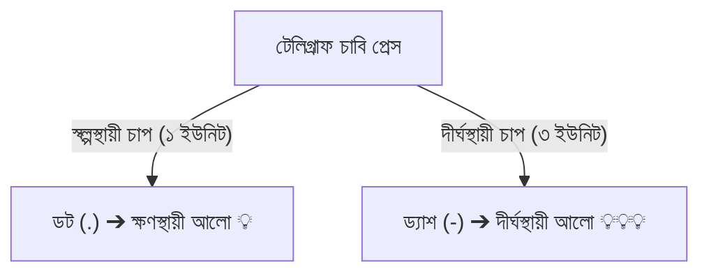
```mermaid
flowchart TD
    Key["টেলিগ্রাফ চাবি প্রেস"]
    Key -->|"স্বল্পস্থায়ী চাপ (১ ইউনিট)"| Dot["ডট (.) ➔ ক্ষণস্থায়ী আলো 💡"]
    Key -->|"দীর্ঘস্থায়ী চাপ (৩ ইউনিট)"| Dash["ড্যাশ (-) ➔ দীর্ঘস্থায়ী আলো 💡💡💡"]
```

---

## ৬. একমুখী যোগাযোগ সার্কিট (One-Way Circuit — ২ তার)

**একনজরে:** A থেকে B-তে খবর পাঠাতে ২টি লম্বা তার প্রয়োজন (১টি যাওয়ার + ১টি ফেরার)।

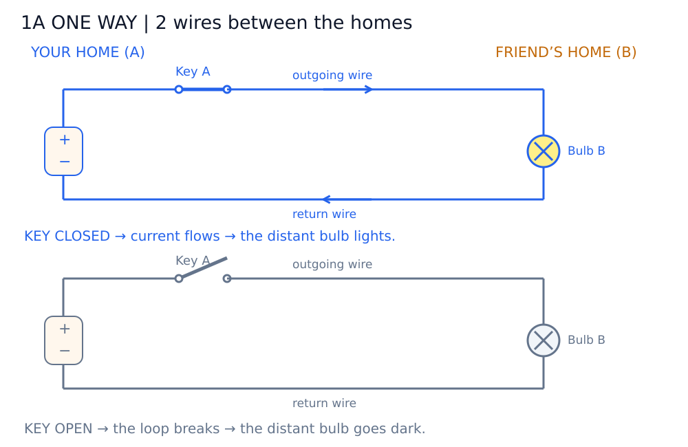

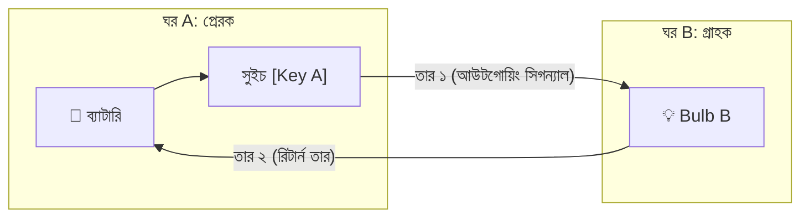
```mermaid
flowchart LR
    subgraph Sender ["ঘর A: প্রেরক"]
        BatA["🔋 ব্যাটারি"] --> KeyA["সুইচ [Key A]"]
    end

    subgraph Receiver ["ঘর B: গ্রাহক"]
        BulbB["💡 Bulb B"]
    end

    KeyA -->|"তার ১ (আউটগোয়িং সিগন্যাল)"| BulbB
    BulbB -->|"তার ২ (রিটার্ন তার)"| BatA
```

- **তারের সংখ্যা:** ২টি লম্বা তার।
- **সীমাবদ্ধতা:** B কেবল বার্তা দেখতে পারে, কিন্তু A-কে উত্তর পাঠাতে পারে না।

---

## ৭. দ্বিমুখী যোগাযোগের প্রাথমিক ধারণা (Bidirectional Concept)

**একনজরে:** দুই বন্ধুকেই বার্তা পাঠাতে ও গ্রহণ করতে হলে দুটি পৃথক একমুখী সার্কিট প্রয়োজন।

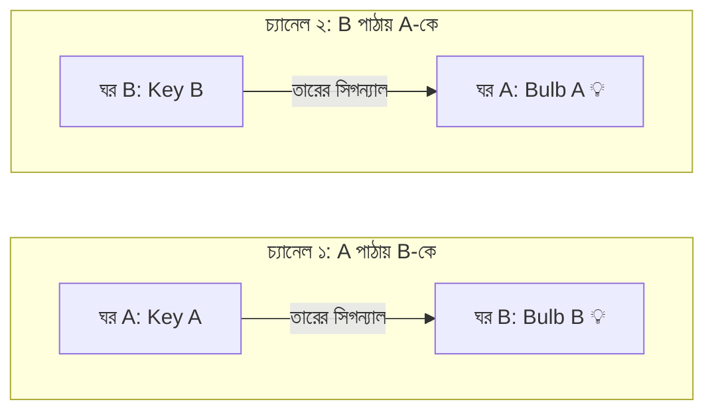
```mermaid
flowchart LR
    subgraph Line1 ["চ্যানেল ১: A পাঠায় B-কে"]
        direction LR
        KeyA["ঘর A: Key A"] -->|"তারের সিগন্যাল"| BulbB["ঘর B: Bulb B 💡"]
    end

    subgraph Line2 ["চ্যানেল ২: B পাঠায় A-কে"]
        direction LR
        KeyB["ঘর B: Key B"] -->|"তারের সিগন্যাল"| BulbA["ঘর A: Bulb A 💡"]
    end
```

---

## ৮. ৪-তারের দ্বিমুখী ব্যবস্থা (4-Wire Bidirectional System)

**একনজরে:** দুটি সম্পূর্ণ স্বাধীন সার্কিট। প্রতিটি সার্কিটে ২টি করে মোট **৪টি লম্বা তার** লাগে।

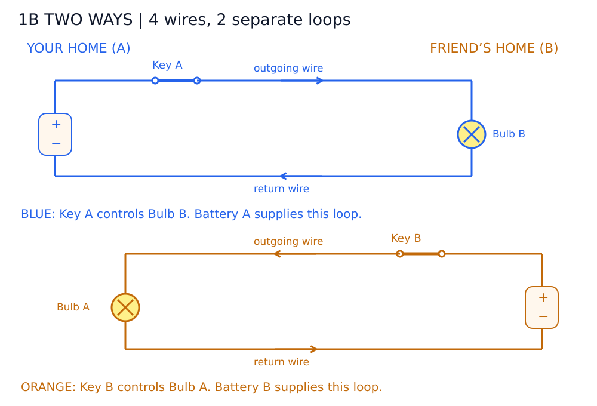

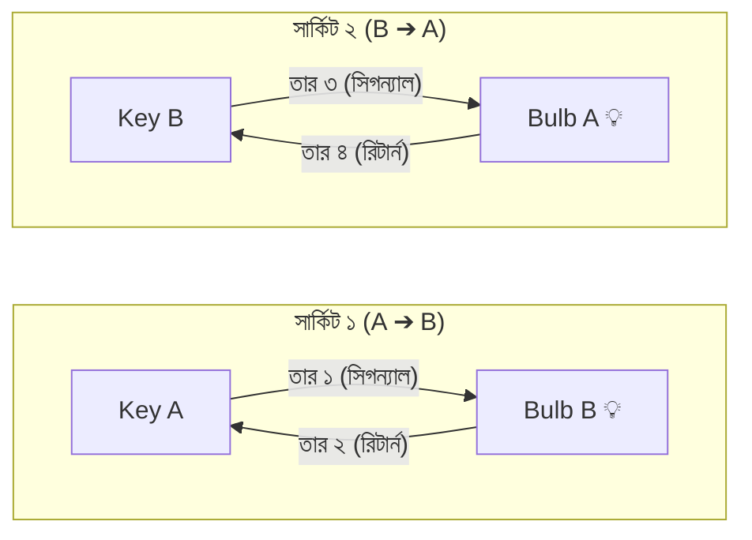
```mermaid
flowchart LR
    subgraph Circuit1 ["সার্কিট ১ (A ➔ B)"]
        direction LR
        A1["Key A"] -->|"তার ১ (সিগন্যাল)"| B1["Bulb B 💡"]
        B1 -->|"তার ২ (রিটার্ন)"| A1
    end

    subgraph Circuit2 ["সার্কিট ২ (B ➔ A)"]
        direction LR
        B2["Key B"] -->|"তার ৩ (সিগন্যাল)"| A2["Bulb A 💡"]
        A2 -->|"তার ৪ (রিটার্ন)"| B2
    end
```

- **তারের সংখ্যা:** মোট ৪টি লম্বা তার।
- **সমস্যা:** দীর্ঘ দূরত্বে ৪টি তার টানা অত্যন্ত ব্যয়বহুল, ভারী এবং জটিল।

---

## ৯. কমন ওয়্যার ব্যবস্থা (3-Wire System — কমন রিটার্ন তার)

**একনজরে:** দুটি সার্কিটের নেগেটিভ (-) টার্মিনালকে একটিমাত্র তারে যুক্ত করে **১টি তার বাঁচানো যায়** (৪টি তার ➔ ৩টি তার, ২৫% সাশ্রয়)।

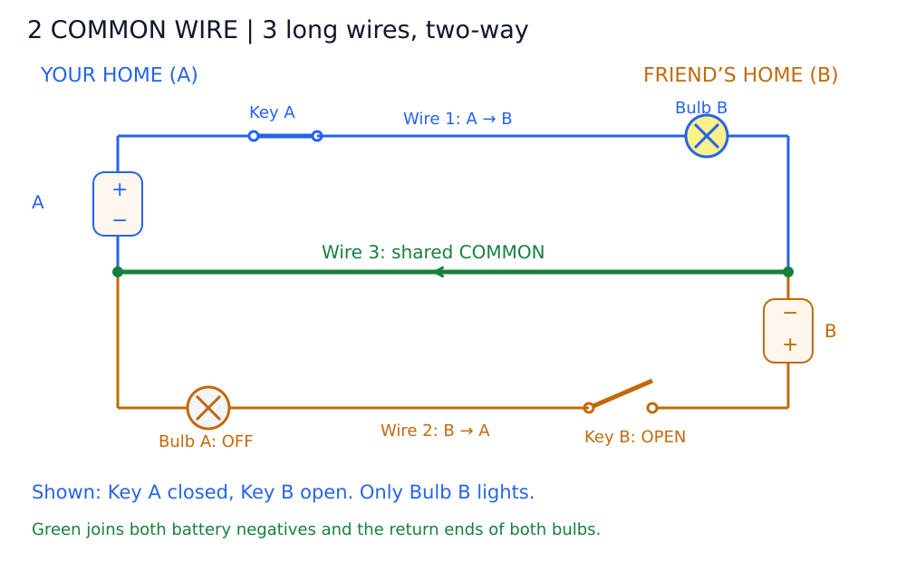

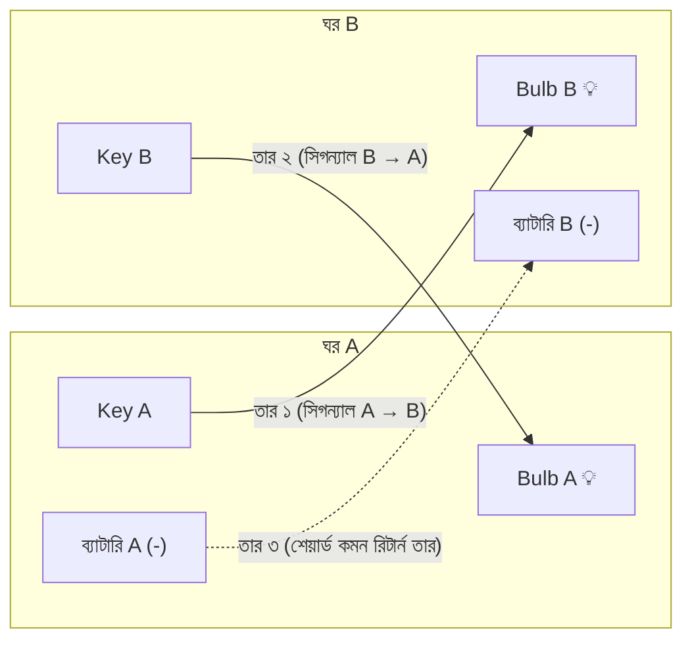
```mermaid
flowchart LR
    subgraph House_A ["ঘর A"]
        KA["Key A"]
        BA["Bulb A 💡"]
        BatA["ব্যাটারি A (-)"]
    end

    subgraph House_B ["ঘর B"]
        KB["Key B"]
        BB["Bulb B 💡"]
        BatB["ব্যাটারি B (-)"]
    end

    KA -->|"তার ১ (সিগন্যাল A → B)"| BB
    KB -->|"তার ২ (সিগন্যাল B → A)"| BA
    BatA -.->|"তার ৩ (শেয়ার্ড কমন রিটার্ন তার)"| BatB
```

### ট্রুথ টেবিল (Truth Table):

| Key A  | Key B  | কোন বাল্ব জ্বলে? | কমন তারের অবস্থা                                             |
| :----: | :----: | :--------------: | :----------------------------------------------------------- |
|  OFF   |  OFF   |    কোনোটিই নয়    | বিদ্যুৎ নেই                                                  |
| **ON** |  OFF   |    **Bulb B**    | A-এর রিটার্ন বিদ্যুৎ বহন করে                                 |
|  OFF   | **ON** |    **Bulb A**    | B-এর রিটার্ন বিদ্যুৎ বহন করে                                 |
| **ON** | **ON** |    **দুটোই**     | দুই দিকের কারেন্ট কাটাকাটি হয়ে কমন তারে কারেন্ট প্রায় শূন্য! |

---

## ১০. আর্থ গ্রাউন্ড রিটার্ন (Earth as Conductor — ১ ও ২ তারের বিপ্লব)

**একনজরে:** ১৮৩৭ সালে কার্ল স্টেইনহিল আবিষ্কার করেন—**মাটি নিজেই একটি চমৎকার পরিবাহী!** রিটার্ন তারের বদলে মাটির ভেতরে ধাতব রড ঢুকিয়ে দিলে মাটি দিয়ে সার্কিট সম্পূর্ণ হয়।

### ক. একমুখী আর্থ গ্রাউন্ড (মাত্র ১টি লম্বা তার):

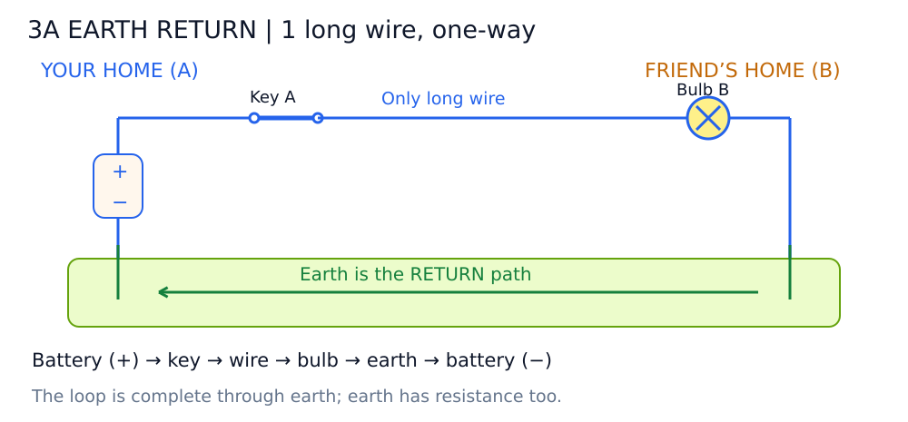

### খ. দ্বিমুখী আর্থ গ্রাউন্ড (মাত্র ২টি লম্বা তার):

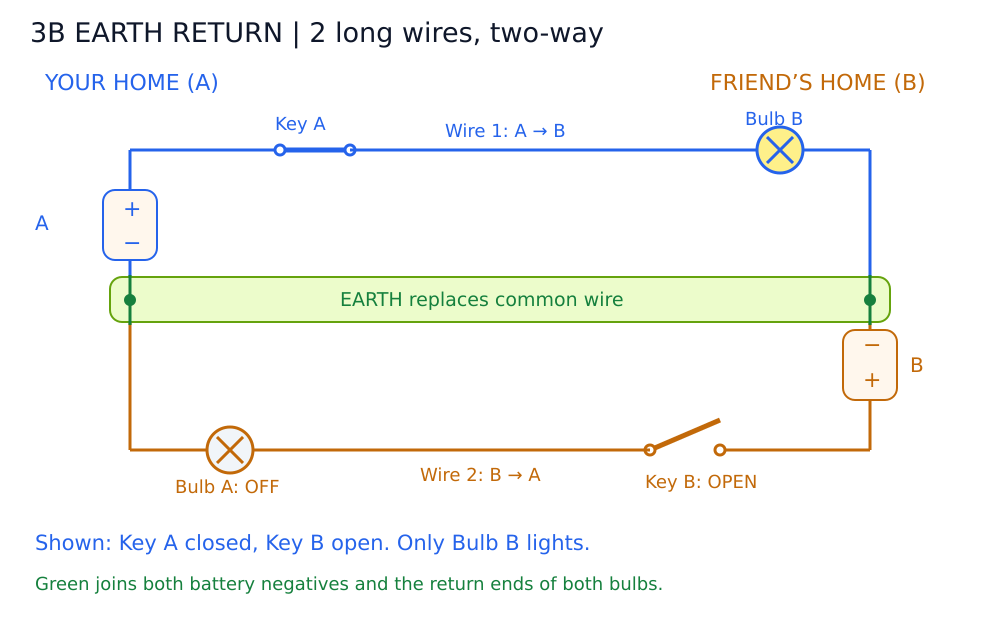

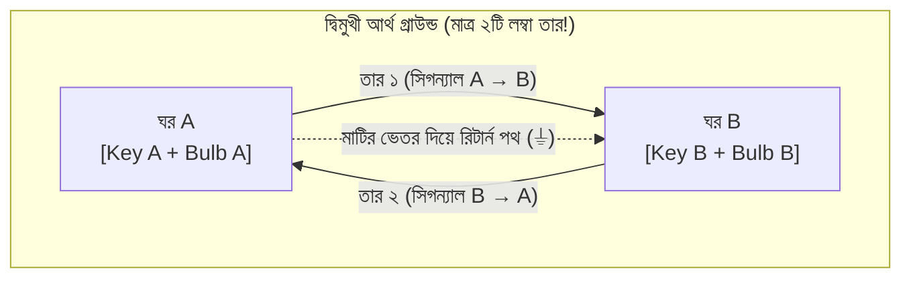
```mermaid
flowchart LR
    subgraph TwoWayEarth ["দ্বিমুখী আর্থ গ্রাউন্ড (মাত্র ২টি লম্বা তার!)"]
        direction LR
        A["ঘর A<br/>[Key A + Bulb A]"] -->|"তার ১ (সিগন্যাল A → B)"| B["ঘর B<br/>[Key B + Bulb B]"]
        B -->|"তার ২ (সিগন্যাল B → A)"| A
        A -.->|"মাটির ভেতর দিয়ে রিটার্ন পথ (⏚)"| B
    end
```

> **সাশ্রয়ের হিসাব:**
>
> - দ্বিমুখী যোগাযোগে: ৪-তারের ব্যবস্থা ➔ **২টি তার + আর্থ গ্রাউন্ড** (৫০% তার সাশ্রয়!)
> - একমুখী যোগাযোগে: ২-তারের ব্যবস্থা ➔ **১টি তার + আর্থ গ্রাউন্ড** (৫০% তার সাশ্রয়!)

---

## ১১. গ্রাউন্ড ও আর্থের পার্থক্য (Ground vs Earth)

**একনজরে:** দৈনন্দিন সার্কিটে গ্রাউন্ড মানে কমন রেফারেন্স পয়েন্ট; টেলিগ্রাফে গ্রাউন্ড মানে আক্ষরিক অর্থেই আমাদের পায়ের নিচের মাটি।

| ধরন                                   | প্রতীক | অর্থ                          | ভূমিকা                                                 |
| :------------------------------------ | :----: | :---------------------------- | :----------------------------------------------------- |
| **আর্থ গ্রাউন্ড (Earth Ground)**      |  `⏚`   | মাটির সাথে সরাসরি সংযোগ       | মাটিকে পরিবাহী হিসেবে ব্যবহার করে সার্কিট সম্পূর্ণ করা |
| **চেসিস গ্রাউন্ড (Chassis Ground)**   |  `⌸`   | ধাতব ফ্রেমের সাথে সংযোগ       | গাড়ির বডি বা মেটাল কেসিংকে কমন ওয়্যার হিসেবে ব্যবহার   |
| **সিগন্যাল গ্রাউন্ড (Signal Ground)** |  `▽`   | সার্কিটের 0V রেফারেন্স পয়েন্ট | সমস্ত ভোল্টেজ পরিমাপের বেসলাইন (রেফারেন্স লেভেল)       |

---

## ১২. ইলেকট্রনের মহাসমুদ্র: আর্থের ধারণা (Earth as Electron Reservoir)

**একনজরে:** সমুদ্র থেকে এক বালতি পানি তুললে বা ঢাললে যেমন সমুদ্রের পানির স্তর বদলায় না, তেমনি পৃথিবীতে কোটি কোটি ইলেকট্রন ঢাললেও বা নিলেও পৃথিবীর চার্জ শূন্য (0V) থাকে।

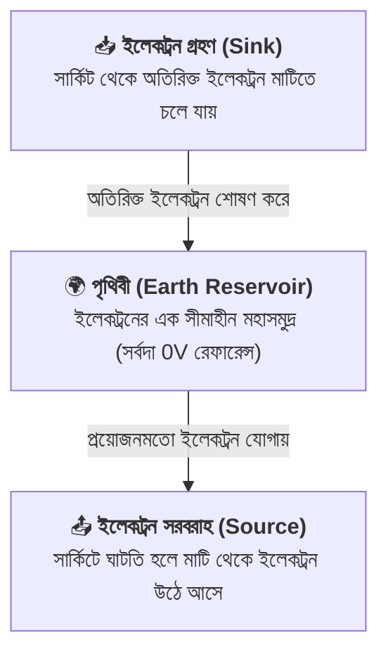
```mermaid
flowchart TD
    Earth["🌍 <b>পৃথিবী (Earth Reservoir)</b><br/>ইলেকট্রনের এক সীমাহীন মহাসমুদ্র (সর্বদা 0V রেফারেন্স)"]

    Sink["📥 <b>ইলেকট্রন গ্রহণ (Sink)</b><br/>সার্কিট থেকে অতিরিক্ত ইলেকট্রন মাটিতে চলে যায়"]
    Source["📤 <b>ইলেকট্রন সরবরাহ (Source)</b><br/>সার্কিটে ঘাটতি হলে মাটি থেকে ইলেকট্রন উঠে আসে"]

    Sink -->|"অতিরিক্ত ইলেকট্রন শোষণ করে"| Earth
    Earth -->|"প্রয়োজনমতো ইলেকট্রন যোগায়"| Source
```

| তুলনা               | সমুদ্রের উপমা (Ocean)                         | পৃথিবীর বাস্তবতা (Earth Ground)                                     |
| :------------------ | :-------------------------------------------- | :------------------------------------------------------------------ |
| **ভাণ্ডার**         | অফুরন্ত পানির ভাণ্ডার                         | অফুরন্ত ইলেকট্রনের ভাণ্ডার                                          |
| **প্রবাহের প্রভাব** | পানি ঢাললে বা তুললে পানির স্তর বাড়ে বা কমে না | কোটি কোটি ইলেকট্রন গ্রহণ বা সরবরাহ করলেও চার্জ বদলায় না (সর্বদা 0V) |

---

## ১৩. ভোল্টেজ ও গ্রাউন্ডের মহাকর্ষীয় উপমা (Voltage & Ground Analogy)

**একনজরে:** ভোল্টেজ হলো উচ্চতার মতো পটেনশিয়াল এনার্জি, আর গ্রাউন্ড হলো ভূমিস্তর (উচ্চতা = ০)।

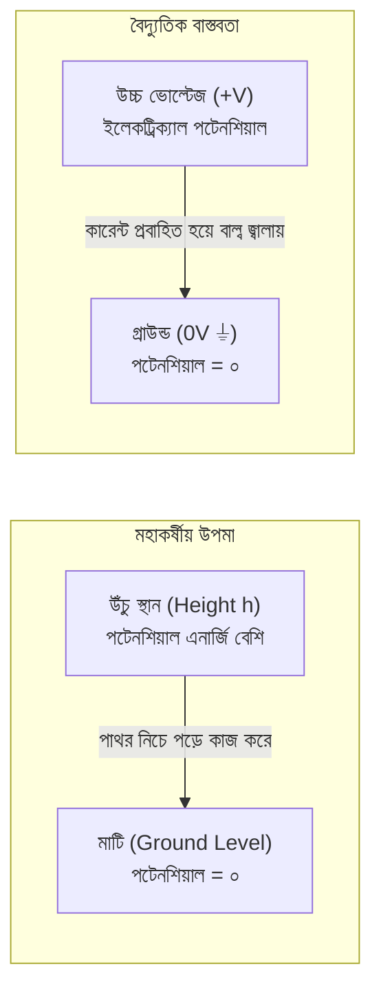
```mermaid
flowchart LR
    subgraph Gravitational ["মহাকর্ষীয় উপমা"]
        H["উঁচু স্থান (Height h)<br/>পটেনশিয়াল এনার্জি বেশি"] -->|"পাথর নিচে পড়ে কাজ করে"| Ground["মাটি (Ground Level)<br/>পটেনশিয়াল = ০"]
    end

    subgraph Electrical ["বৈদ্যুতিক বাস্তবতা"]
        V["উচ্চ ভোল্টেজ (+V)<br/>ইলেকট্রিক্যাল পটেনশিয়াল"] -->|"কারেন্ট প্রবাহিত হয়ে বাল্ব জ্বালায়"| EGround["গ্রাউন্ড (0V ⏚)<br/>পটেনশিয়াল = ০"]
    end
```

---

## ১৪. খোলা মনে হলেও সার্কিট কীভাবে সম্পূর্ণ? (Complete Circuit via Ground)

**একনজরে:** ডায়াগ্রামে তারের শেষ মাথায় শুধু গ্রাউন্ড প্রতীক `⏚` আঁকা থাকে, কোনো ফেরত লাইন থাকে না। কিন্তু মনে রাখতে হবে—মাটির ভেতর দিয়ে একটি অদৃশ্য ও কার্যকর রিটার্ন সংযোগ বিদ্যমান।

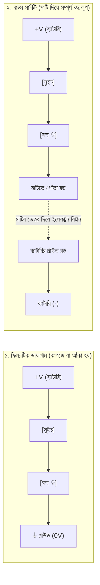
```mermaid
flowchart LR
    subgraph Schematic ["১. স্কিম্যাটিক ডায়াগ্রাম (কাগজে যা আঁকা হয়)"]
        direction TB
        V1["+V (ব্যাটারি)"] --> S1["[সুইচ]"] --> B1["[বাল্ব 💡]"] --> G1["⏚ গ্রাউন্ড (0V)"]
    end

    subgraph Reality ["২. বাস্তব সার্কিট (মাটি দিয়ে সম্পূর্ণ বদ্ধ লুপ)"]
        direction TB
        V2["+V (ব্যাটারি)"] --> S2["[সুইচ]"] --> B2["[বাল্ব 💡]"]
        B2 --> Rod1["মাটিতে পোঁতা রড"]
        Rod1 -.->|"মাটির ভেতর দিয়ে ইলেকট্রন রিটার্ন"| Rod2["ব্যাটারির গ্রাউন্ড রড"]
        Rod2 --> BatNeg["ব্যাটারি (-)"]
    end
```

---

## ১৫. তারের দৈর্ঘ্য ও রোধের সমস্যা (Wire Resistance Problem)

**একনজরে:** তার যত লম্বা হয়, তারের অভ্যন্তরীণ রোধ (Resistance) তত বাড়ে। ফলে কারেন্ট কমে গিয়ে দূরবর্তী বাল্ব আর জ্বলে না।

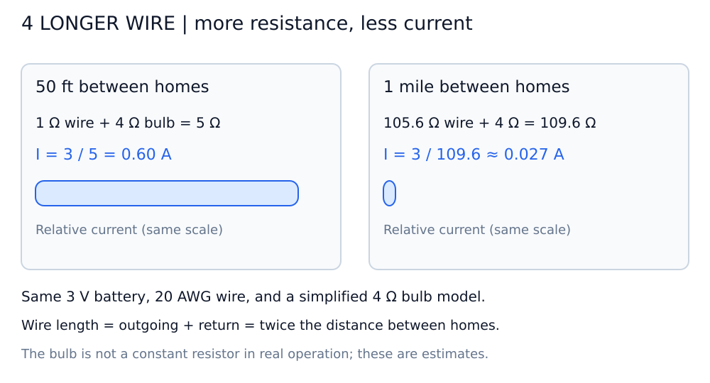

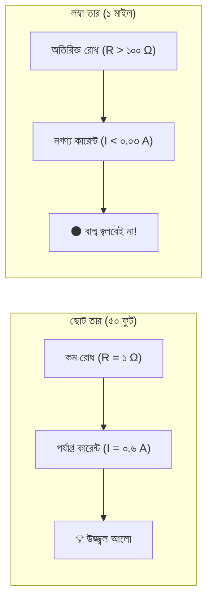
```mermaid
flowchart LR
    subgraph Short ["ছোট তার (৫০ ফুট)"]
        R1["কম রোধ (R = ১ Ω)"] --> I1["পর্যাপ্ত কারেন্ট (I = ০.৬ A)"] --> L1["💡 উজ্জ্বল আলো"]
    end

    subgraph Long ["লম্বা তার (১ মাইল)"]
        R2["অতিরিক্ত রোধ (R > ১০০ Ω)"] --> I2["নগণ্য কারেন্ট (I < ০.০৩ A)"] --> L2["🌑 বাল্ব জ্বলবেই না!"]
    end
```

---

## ১৬. ওহমের সূত্র ও দূরত্বের প্রভাব (Ohm's Law in Action)

$$\text{Current } I = \frac{V}{R_{\text{bulb}} + R_{\text{wire}}}$$

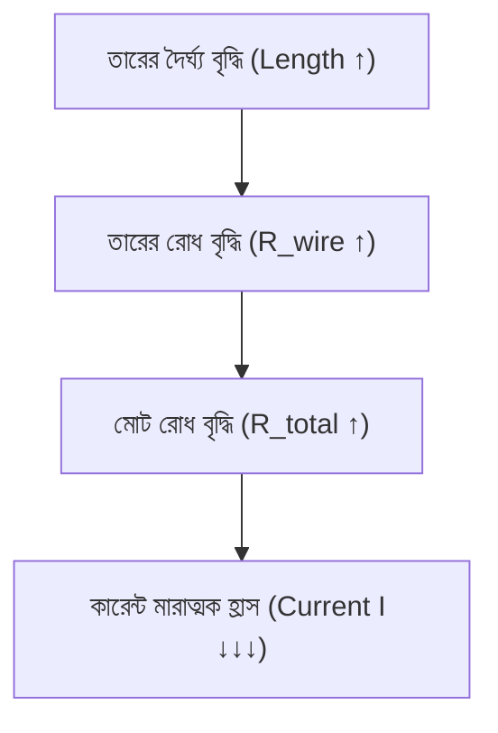
```mermaid
flowchart TD
    Len["তারের দৈর্ঘ্য বৃদ্ধি (Length ↑)"] --> Res["তারের রোধ বৃদ্ধি (R_wire ↑)"]
    Res --> Tot["মোট রোধ বৃদ্ধি (R_total ↑)"]
    Tot --> Cur["কারেন্ট মারাত্মক হ্রাস (Current I ↓↓↓)"]
```

---

## ১৭. তারের পুরুত্ব ও AWG (Wire Thickness & American Wire Gauge)

**একনজরে:** AWG নম্বর যত **ছোট**, তার তত **মোটা** এবং তারের রোধ তত **কম**।

|  AWG গেজ   |     তারের ব্যাস      | রোধ (প্রতি ১০০০ ফুটে) | সুবিধা / অসুবিধা                                 |
| :--------: | :------------------: | :-------------------: | :----------------------------------------------- |
| **AWG 10** |  ৫.২৬ মিমি² (মোটা)   |      প্রায় ১.০ Ω      | কম ভোল্টেজ ড্রপ, কিন্তু অত্যন্ত ভারী ও ব্যয়বহুল  |
| **AWG 20** | ০.৫২ মিমি² (মাঝারি)  |     প্রায় ১০.১ Ω      | স্ট্যান্ডার্ড টেলিগ্রাফ ওয়্যার                   |
| **AWG 30** | ০.০৫ মিমি² (খুব সরু) |     প্রায় ১০৩.০ Ω     | অতিরিক্ত রোধ, দূরবর্তী টেলিগ্রাফে সম্পূর্ণ অকেজো |

---

## ১৮. একনজরে তারের সংখ্যা ও সাশ্রয় (Wire Count Summary)

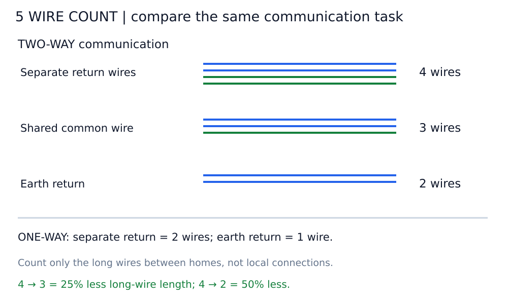

| যোগাযোগ ব্যবস্থা | ব্যবহৃত মাধ্যম     | দুই ঘরের মাঝের লম্বা তার | মোট তার সাশ্রয় |
| :--------------- | :----------------- | :----------------------: | :------------: |
| **একমুখী**       | পৃথক রিটার্ন তার   |           ২টি            |    বেসলাইন     |
| **একমুখী**       | আর্থ গ্রাউন্ড (⏚)  |         **১টি**          | **৫০% সাশ্রয়** |
| **দ্বিমুখী**     | ২টি পৃথক লুপ       |           ৪টি            |    বেসলাইন     |
| **দ্বিমুখী**     | শেয়ার্ড কমন ওয়্যার |           ৩টি            |   ২৫% সাশ্রয়   |
| **দ্বিমুখী**     | আর্থ গ্রাউন্ড (⏚)  |         **২টি**          | **৫০% সাশ্রয়** |

---

## ১৯. দূরপাল্লার সমাধান: অটোমেটিক রিলে (The Relay Solution)

**একনজরে:** দুর্বল হয়ে আসা সিগন্যাল দিয়ে বাল্ব না জ্বালিয়ে একটি **ইলেক্ট্রোম্যাগনেট (রিলে)** সক্রিয় করা হয়। সেই চুম্বক একটি নতুন সুইচে টান দেয়, যা সম্পূর্ণ নতুন তাজা ব্যাটারির সাহায্যে পূর্ণ শক্তিতে সিগন্যালকে পরবর্তী মাইলে পাঠিয়ে দেয়!

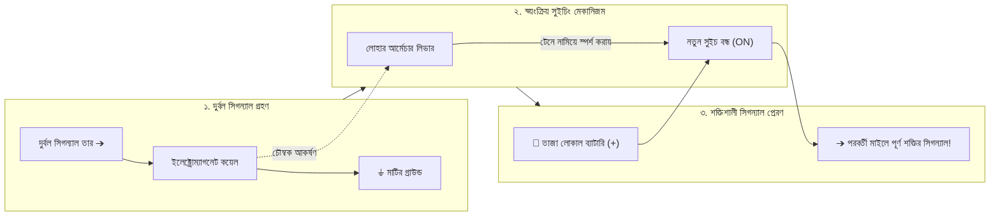
```mermaid
flowchart LR
    subgraph InPart ["১. দুর্বল সিগন্যাল গ্রহণ"]
        direction TB
        Sig["দুর্বল সিগন্যাল তার ➔"] --> Coil["ইলেক্ট্রোম্যাগনেট কয়েল"]
        Coil --> Grd["⏚ মাটির গ্রাউন্ড"]
    end

    subgraph MechPart ["২. স্বয়ংক্রিয় সুইচিং মেকানিজম"]
        direction TB
        Coil -.->|"চৌম্বক আকর্ষণ"| Arm["লোহার আর্মেচার লিভার"]
        Arm -->|"টেনে নামিয়ে স্পর্শ করায়"| Contact["নতুন সুইচ বন্ধ (ON)"]
    end

    subgraph OutPart ["৩. শক্তিশালী সিগন্যাল প্রেরণ"]
        direction TB
        Bat["🔋 তাজা লোকাল ব্যাটারি (+)"] --> Contact
        Contact --> Next["➔ পরবর্তী মাইলে পূর্ণ শক্তির সিগন্যাল!"]
    end

    InPart --> MechPart --> OutPart
```

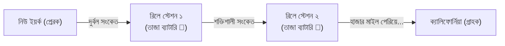
```mermaid
flowchart LR
    NY["নিউ ইয়র্ক (প্রেরক)"] -->|"দুর্বল সংকেত"| R1["রিলে স্টেশন ১<br/>(তাজা ব্যাটারি 🔋)"]
    R1 -->|"শক্তিশালী সংকেত"| R2["রিলে স্টেশন ২<br/>(তাজা ব্যাটারি 🔋)"]
    R2 -->|"হাজার মাইল পেরিয়ে..."| CA["ক্যালিফোর্নিয়া (গ্রাহক)"]
```

---

## ২০. টেলিগ্রাফ সাউন্ডার: আলো থেকে শব্দে রূপান্তর (Telegraph Sounder)

**একনজরে:** দিনের আলোতে বাল্বের আলো দেখা কঠিন এবং বাল্ব জ্বলতে-নিভতে সামান্য সময় নেয়। তাই বাল্ব সরিয়ে **শব্দ তৈরি করার যন্ত্র (সাউন্ডার)** ব্যবহার করা হয়।

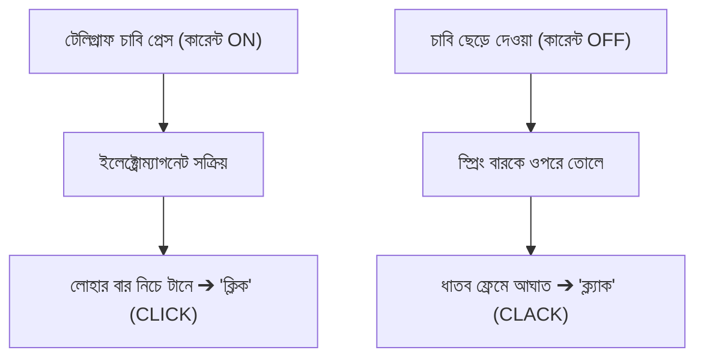
```mermaid
flowchart TD
    Key["টেলিগ্রাফ চাবি প্রেস (কারেন্ট ON)"] --> Mag["ইলেক্ট্রোম্যাগনেট সক্রিয়"] --> Down["লোহার বার নিচে টানে ➔ 'ক্লিক' (CLICK)"]
    Release["চাবি ছেড়ে দেওয়া (কারেন্ট OFF)"] --> Spring["স্প্রিং বারকে ওপরে তোলে"] --> Up["ধাতব ফ্রেমে আঘাত ➔ 'ক্ল্যাক' (CLACK)"]
```

### মোর্স কোডের শ্রুতিগ্রাহ্য রূপ:

- **ডট (.):** দ্রুত `ক্লিক-ক্ল্যাক` (CLICK-CLACK)
- **ড্যাশ (-):** ব্যবধানযুক্ত `ক্লিক ... ক্ল্যাক` (CLICK ... CLACK)
- **সুবিধা:** অপারেটরকে সারাক্ষণ তাকিয়ে থাকতে হয় না; কান দিয়ে শুনে হাত দিয়ে সরাসরি কাগজে বার্তা লিখে ফেলা যায়।

---

## ২১. অধ্যায় ৫-এর পূর্ণাঙ্গ ট্রান্সমিশন পাইপলাইন (Complete Pipeline)

**একনজরে:** মানুষের মস্তিষ্ক থেকে বার্তা শুরু হয়ে গ্রাহকের কানে পৌঁছানোর সম্পূর্ণ যাত্রা।

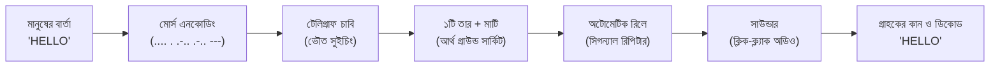
```mermaid
flowchart LR
    M["মানুষের বার্তা<br/>'HELLO'"] --> Enc["মোর্স এনকোডিং<br/>(.... . .-.. .-.. ---)"]
    Enc --> Key["টেলিগ্রাফ চাবি<br/>(ভৌত সুইচিং)"]
    Key --> Trans["১টি তার + মাটি<br/>(আর্থ গ্রাউন্ড সার্কিট)"]
    Trans --> Rel["অটোমেটিক রিলে<br/>(সিগন্যাল রিপিটার)"]
    Rel --> Sound["সাউন্ডার<br/>(ক্লিক-ক্ল্যাক অডিও)"]
    Sound --> Dec["গ্রাহকের কান ও ডিকোড<br/>'HELLO'"]
```

---

## ২২. অধ্যায় ১ বনাম অধ্যায় ৫: সরাসরি তুলনা (Ch 1 vs Ch 5)

| তুলনার বিষয়     | অধ্যায় ১: Best Friends  | অধ্যায় ৫: Seeing Around Corners             |
| :-------------- | :---------------------- | :------------------------------------------ |
| **মাধ্যম**      | আলো (ফোটন)              | তড়িৎপ্রবাহ (ইলেকট্রন)                       |
| **বাহক**        | বাতাস ও মহাশূন্য        | তামার তার ও আর্থ গ্রাউন্ড                   |
| **বাধা**        | দেয়াল বা বাঁকে আটকে যায় | তার যেখানে বাঁকে, বিদ্যুৎ সেখানেই যায়       |
| **দূরত্ব সীমা** | দৃষ্টিসীমা (কয়েকশ ফুট)  | রিলে ব্যবহারের মাধ্যমে হাজার হাজার মাইল     |
| **আউটপুট**      | বাল্বের চোখের দেখা আলো  | সাউন্ডারের শ্রুতিগ্রাহ্য ক্লিক-ক্ল্যাক শব্দ |

---

## ২৩. কম্পিউটারের জন্মলগ্নে বড় রূপরেখা (The Big Picture)

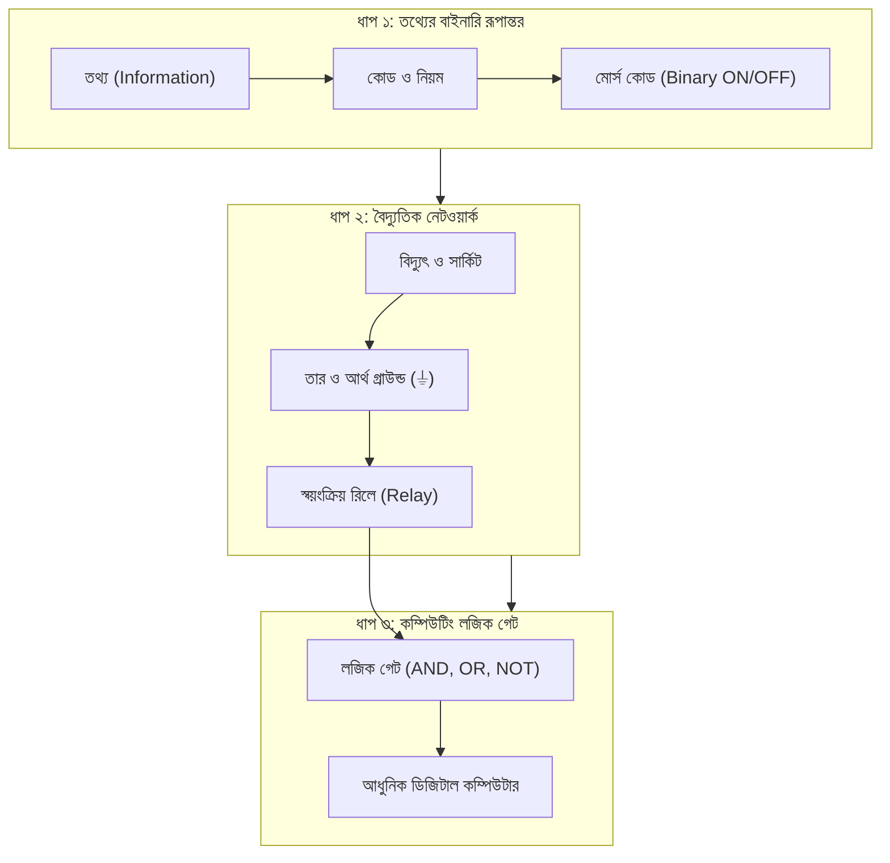
```mermaid
flowchart TD
    subgraph Stage1 ["ধাপ ১: তথ্যের বাইনারি রূপান্তর"]
        direction LR
        Inf["তথ্য (Information)"] --> Code["কোড ও নিয়ম"] --> Morse["মোর্স কোড (Binary ON/OFF)"]
    end

    subgraph Stage2 ["ধাপ ২: বৈদ্যুতিক নেটওয়ার্ক"]
        direction LR
        Elec["বিদ্যুৎ ও সার্কিট"] --> Wire["তার ও আর্থ গ্রাউন্ড (⏚)"] --> Relay["স্বয়ংক্রিয় রিলে (Relay)"]
    end

    subgraph Stage3 ["ধাপ ৩: কম্পিউটিং লজিক গেট"]
        direction LR
        Relay --> Logic["লজিক গেট (AND, OR, NOT)"] --> CPU["আধুনিক ডিজিটাল কম্পিউটার"]
    end

    Stage1 --> Stage2 --> Stage3
```

---

## ২৪. মূল অনুধাবন ও টেকঅ্যাওয়ে (Core Mental Model)

```text
┌────────────────────────────────────────────────────────────────────────┐
│                        অধ্যায় ৫-এর চিরন্তন শিক্ষা:                    │
│                                                                        │
│   "কোড (তথ্য) এবং মাধ্যম (তড়িৎ বা আলো) দুটি সম্পূর্ণ আলাদা বিষয়।      │
│    একই মোর্স কোড আলো দিয়েও পাঠানো যায়, আবার তারের ভেতর দিয়ে           │
│    ইলেকট্রন দিয়েও পাঠানো যায়।"                                         │
│                                                                        │
│   সবচেয়ে বড় দুটি উদ্ভাবন:                                             │
│   ১. মাটিকে রিটার্ন তার হিসেবে ব্যবহার (Earth Ground)।                │
│   ২. মানুষের হাতের বদলে বিদ্যুৎ দিয়ে সুইচ চালানো (Relay) —             │
│      যা পরবর্তীতে আধুনিক কম্পিউটারের লজিক গেটের জন্ম দেয়!             │
└────────────────────────────────────────────────────────────────────────┘
```
