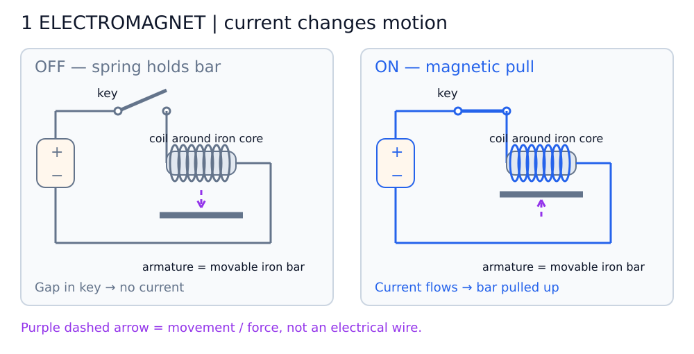
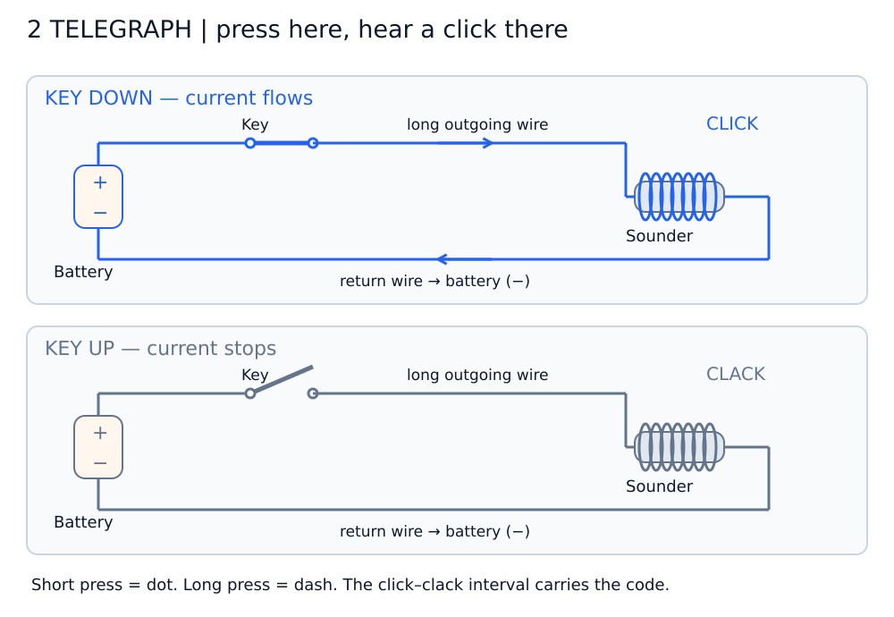
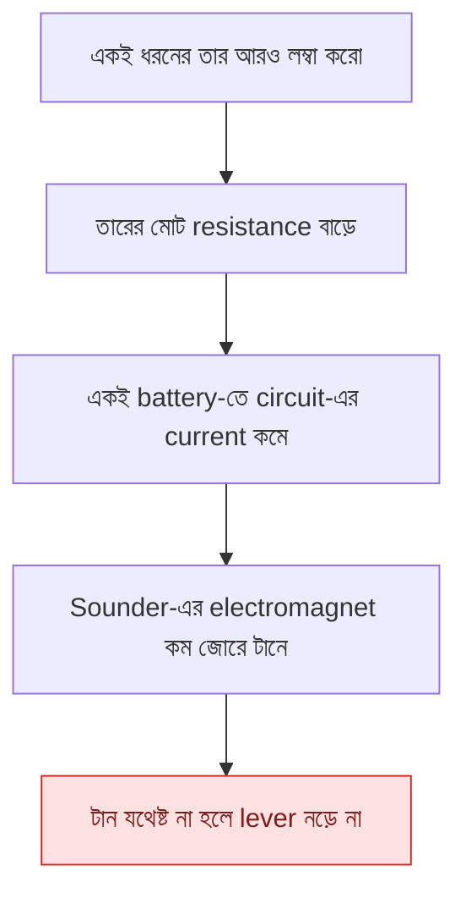
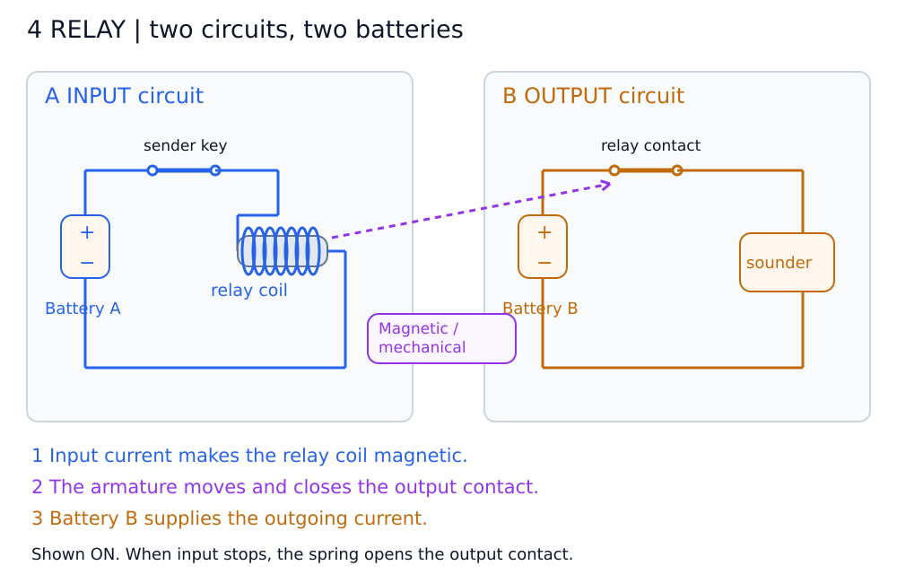
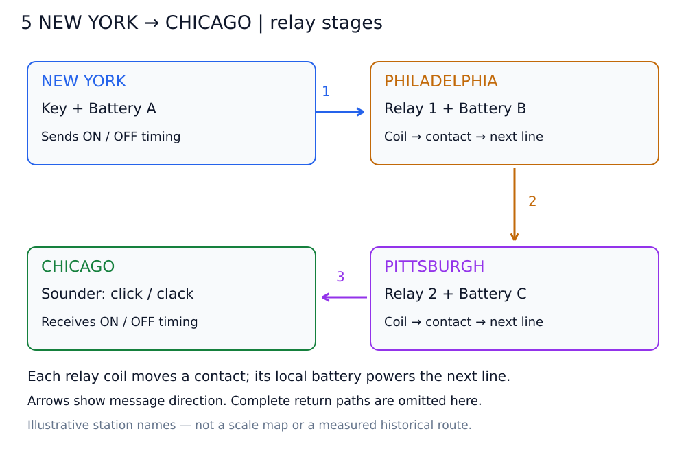
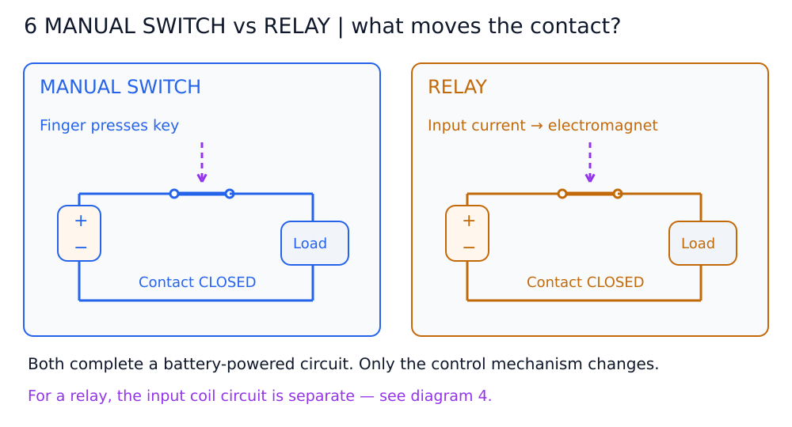

# অধ্যায় ৬: Telegraphs and Relays — ছবি দেখে বোঝো

**চাবি চাপা → coil চুম্বক হওয়া → লোহার পাত নড়া → শব্দ বা আরেকটি switch চালু হওয়া।**

ছবিগুলো Markdown Preview-তে দেখো। SVG ছবি সরাসরিও খোলা যায়; এই পাঁচটির জন্য Mermaid দরকার নেই।

**ছবি পড়ার নিয়ম:** মোটা রঙিন রেখা = electrical পথ; বেগুনি dashed arrow = টান/নড়াচড়া। Battery-র `+` থেকে বাইরের circuit হয়ে `−`-এ ফিরতে হবে। Switch-এর দুই বিন্দুর মধ্যে ফাঁক থাকলে current বন্ধ। ছবির যন্ত্রাংশ বোঝানোর জন্য সরল করা হয়েছে।

## ডায়াগ্রাম ১: ইলেক্ট্রোম্যাগনেটের মেকানিক্স

**বাম = OFF, ডান = ON।** ধূসর আয়তাকার অংশ iron core; তার চারপাশের প্যাঁচগুলো coil; নিচের মোটা ধূসর দাগ নড়তে পারা লোহার পাত বা armature।

বাম ছবিতে key খোলা, তাই current নেই; spring পাতটিকে coil থেকে দূরে রাখে। ডান ছবিতে key বন্ধ, coil দিয়ে current চলে, core চুম্বক হয় এবং পাতটিকে ওপরে টানে। পাতটি current-এর পথের অংশ নয়।

---

## ডায়াগ্রাম ২: ৩-উপাদানের মৌলিক টেলিগ্রাফ সার্কিট

**ওপরে = key চেপে ধরা, নিচে = ছেড়ে দেওয়া।** মূল তিনটি উপাদান হলো battery, key ও sounder; তার দিয়ে এদের যুক্ত করা হয়।

ওপরের নীল পথ অনুসরণ করো: battery (+) → key → লম্বা তার → sounder coil → ফেরার তার → battery (−)। Key চাপার মুহূর্তে lever টেনে CLICK; ছাড়লে spring ফেরায়, CLACK। ছোট ব্যবধান = dot; বড় ব্যবধান = dash। বইয়ের earth-return ব্যবস্থায় ফেরার তারের জায়গায় মাটি conductive পথ দেয়; current হারিয়ে যায় না।

---

## ৩. দূরত্ব বাড়লে সমস্যা কোথায়?

**একনজরে:** লম্বা তার → বেশি resistance → কম current → lever টানার শক্তি কম।

সহজ steady-state ধারণা: `I = V / R_total`। এখানে battery, তার, coil এবং return path মিলিয়ে মোট resistance ধরতে হবে।

একটি series circuit-এর এক জায়গা থেকে আরেক জায়গায় যেতে যেতে current “খরচ” হয়ে কমে না। **আরও লম্বা তার দিয়ে circuit বানালে পুরো loop-এর current কম হয়।** কত মাইলে কাজ বন্ধ হবে, তার নির্দিষ্ট সর্বজনীন মান নেই; battery, তার ও receiver-এর ওপর নির্ভর করে।

---

## ডায়াগ্রাম ৪: রিলের সংকেত পুনরুজ্জীবন সার্কিট

**নীল = input circuit; কমলা = output circuit। দুটির আলাদা battery আছে।** ছবিতে দুটোই ON।

১. Battery A-এর current relay coil-কে চুম্বক বানায়।
২. চুম্বকের টানে armature output contact বন্ধ করে।
৩. Battery B থেকে নতুন current sounder চালায়।

বেগুনি dashed রেখা **তার নয়**; এটি mechanical control বোঝায়। Input current কম হলেও relay টানার জন্য যথেষ্ট হতে হবে। Output-এর শক্তি আসে Battery B থেকে; একই current বড় হয়ে coil থেকে বেরোয় না। Input OFF হলে spring contact খুলে দেয়, output current বন্ধ হয়।

---

## ডায়াগ্রাম ৫: নিউ ইয়র্ক থেকে শিকাগো বহু-স্টেশন রিলে নেটওয়ার্ক

**পড়ার ক্রম: ওপরের বাঁ → ওপরের ডান → নিচের ডান → নিচের বাঁ।**

নিউ ইয়র্কের key Relay 1-এর coil চালায়। Relay 1-এর contact ও Battery B পরের line চালায়। Relay 2 একইভাবে Battery C দিয়ে শিকাগোর sounder চালায়। প্রতিটি relay শুধু ON/OFF timing অনুসরণ করে; অক্ষর বোঝে না।

এটি signal-এর overview: প্রতিটি ধাপের সম্পূর্ণ return path diagram ৪-এর মতো থাকবে। শহরের নামগুলো উদাহরণ; ছবিটি নির্দিষ্ট ঐতিহাসিক route বা দূরত্বের দাবি নয়।

---

## ডায়াগ্রাম ৬: মেকানিক্যাল সুইচ বনাম রিলের লজিক তুলনা

**বাম দিকে আঙুল contact বন্ধ করে; ডান দিকে electromagnet contact বন্ধ করে।**

দুই ছবিতেই contact বন্ধ হলে battery থেকে load-এ current চলে। Load মানে যে যন্ত্রটিকে চালাচ্ছি—যেমন sounder। Relay-এর electromagnet-এর নিজস্ব input circuit diagram ৪-এ দেখানো আছে; এখানে output loop দেখানো হয়েছে।

মনে রাখো: **Relay = বিদ্যুৎ দিয়ে নিয়ন্ত্রিত mechanical switch।** Relay-এর contact-ও বাস্তবে নড়ে।

---

